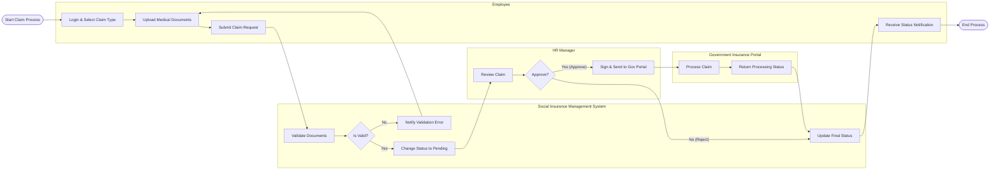

# Swimlane Diagram — Social Insurance Management System

## Mermaid Code

## Flow Description | Mo ta luong

| Lane | Actor | Role in Flow |
|------|-------|-------------|
| 1 | Employee | Nguoi chu dong tao ho so, tai len chung tu va nop len he thong. |
| 2 | Social Insurance Management System | He thong kiem tra tinh hop le, chuyen trang thai va gui thong bao. |
| 3 | HR Manager | Nguoi quan ly nhan su kiem tra thong tin, duyet va ky so gui len co quan BHXH. |
| 4 | Government Insurance Portal | He thong cua co quan BHXH tiep nhan, xu ly va tra ve ket qua cuoi cung. |
