# Action Tree — Social Insurance Management System

## Mermaid Code

```mermaid
%%{init: {'theme': 'default'}}%%
graph TD
    Root["Social Insurance Management System"]

    Root --> M1["Insurance Profiles"]
    Root --> M2["Claim Processing"]
    Root --> M3["Deductions & Finance"]
    Root --> M4["Gov Integration"]
    Root --> M5["System Administration"]

    M1 --> A11["Register New Employee Insurance"]
    M1 --> A12["Update Employee Profile"]
    M1 --> A13["View Insurance History"]
    M1 --> A14["Transfer Insurance Book"]

    M2 --> A21["Submit Claim Request"]
    M2 --> A22["Review & Approve Claims"]
    M2 --> A23["Track Claim Status"]
    M2 --> A24["Manage Medical Documents"]

    M3 --> A31["Configure Deduction Rates"]
    M3 --> A32["Calculate Monthly Contributions"]
    M3 --> A33["Generate Payroll Report"]

    M4 --> A41["Sync Declarations"]
    M4 --> A42["Receive Gov Notifications"]
    M4 --> A43["Digital Signature Setup"]

    M5 --> A51["Manage User Roles"]
    M5 --> A52["Configure System Parameters"]
    M5 --> A53["View System Logs"]
```

## Module Description | Mo ta Module

| # | Module | Description | Actions |
|---|--------|-------------|---------|
| 1 | Insurance Profiles | Quan ly so bao hiem va qua trinh tham gia cua nhan vien | Register New Employee Insurance, Update Employee Profile, View Insurance History, Transfer Insurance Book |
| 2 | Claim Processing | Quan ly cac ho so huong che do bao hiem | Submit Claim Request, Review & Approve Claims, Track Claim Status, Manage Medical Documents |
| 3 | Deductions & Finance | Tinh toan chi phi trich nop bao hiem hang thang | Configure Deduction Rates, Calculate Monthly Contributions, Generate Payroll Report |
| 4 | Gov Integration | Ket noi truc tiep voi cong thong tin BHXH Quoc gia | Sync Declarations, Receive Gov Notifications, Digital Signature Setup |
| 5 | System Administration | Quan tri he thong, phan quyen va cai dat tham so | Manage User Roles, Configure System Parameters, View System Logs |
