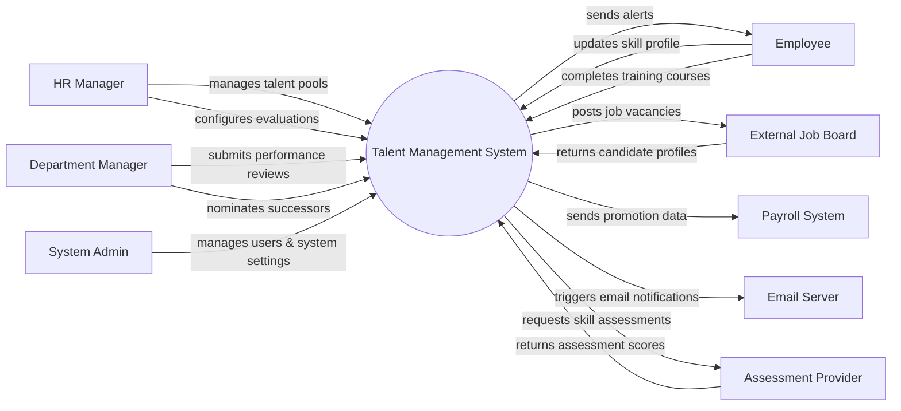

# Context Diagram — Talent Management System

## Mermaid Code

## Actor & Interaction Table | Bang Actor & Tuong tac

| # | Actor | Actor Type | Data Sent TO System | Data Received FROM System | Notes |
|---|-------|------------|---------------------|---------------------------|-------|
| 1 | HR Manager | Primary | Talent pool settings, evaluation configs | Talent reports, analytics | Quan ly nhan su |
| 2 | Employee | Primary | Skill profiles, training completions | Notifications, learning paths | Nhan vien |
| 3 | Department Manager | Primary | Performance reviews, succession nominations | Team performance data | Quan ly bo phan |
| 4 | External Job Board | Supporting | Candidate profiles | Job vacancies | He thong dang tuyen |
| 5 | Payroll System | Supporting | Payroll sync status | Promotion and salary adjustment data | He thong tinh luong |
| 6 | Email Server | Supporting | Delivery statuses | Email notifications | He thong email |
| 7 | Assessment Provider| Supporting | Assessment scores | Skill assessment requests | Doi tac danh gia ky nang |
| 8 | System Admin | Primary | User roles, system configurations | System logs, error reports | Quan tri he thong |

## System Boundary Description | Mo ta Pham vi He thong

The Talent Management System is responsible for managing employee skills, performance reviews, training, and succession planning. It serves as a central platform for HR Managers, Department Managers, and Employees to interact regarding talent development. The system does not directly process payroll but sends promotion and salary adjustment data to the external Payroll System. It integrates with External Job Boards for recruitment and Assessment Providers for evaluating employee competencies.
