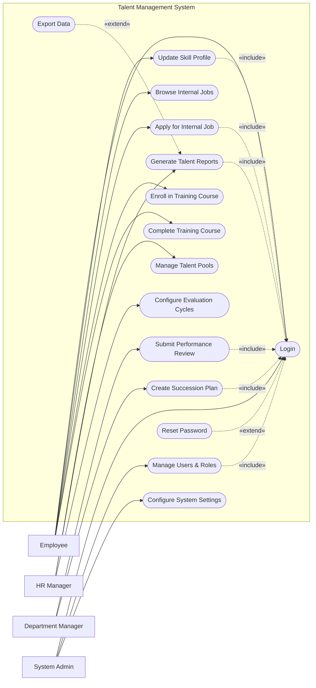

# Use Case Diagram — Talent Management System

## Mermaid Code

## Actor Table | Bang Actor

| # | Actor | Actor Type | Role Description | Related Use Cases |
|---|-------|------------|------------------|-------------------|
| 1 | Employee | Primary | Nhan vien su dung he thong de phat trien ban than | UC01, UC02, UC03, UC04, UC07, UC08 |
| 2 | Department Manager | Primary | Quan ly danh gia nang luc nhan vien | UC05, UC06 |
| 3 | HR Manager | Primary | Nguoi quan ly chien luoc phat trien nhan su | UC09, UC10, UC11 |
| 4 | System Admin | Primary | Quan tri vien he thong, phan quyen | UC01, UC12, UC13 |

## Use Case Table | Bang Use Case

| # | UC ID | Use Case Name | Primary Actor | Secondary Actor | Description | Priority |
|---|-------|---------------|---------------|-----------------|-------------|----------|
| 1 | UC01 | Login | Employee | | Authenticate user access | High |
| 2 | UC02 | Update Skill Profile | Employee | | Maintain personal skills and competencies | Medium |
| 3 | UC03 | Browse Internal Jobs | Employee | | View available internal job postings | Low |
| 4 | UC04 | Apply for Internal Job | Employee | | Submit application for a new internal role | High |
| 5 | UC05 | Submit Performance Review | Department Manager| | Evaluate employee performance | High |
| 6 | UC06 | Create Succession Plan | Department Manager| HR Manager | Plan future replacements for key roles | High |
| 7 | UC07 | Enroll in Training Course | Employee | | Register for learning programs | Medium |
| 8 | UC08 | Complete Training Course | Employee | | Finish training and update skills | Medium |
| 9 | UC09 | Manage Talent Pools | HR Manager | | Group and track high-potential employees | High |
| 10| UC10 | Generate Talent Reports | HR Manager | | Create analytical reports on talent | Medium |
| 11| UC11 | Configure Evaluation Cycles | HR Manager | | Set up appraisal periods and forms | High |
| 12| UC12 | Manage Users & Roles | System Admin | | Administer user accounts | High |
| 13| UC13 | Configure System Settings | System Admin | | Manage system-wide parameters | Medium |
| 14| UC14 | Reset Password | Employee | | Recover forgotten passwords | High |
| 15| UC15 | Export Data | HR Manager | | Export reports to external files | Low |

## Use Case Specification | Dac ta Use Case

---

### UC01 — Login

| Field | Detail |
|-------|--------|
| **UC ID** | UC01 |
| **Use Case Name** | Login |
| **Actor(s)** | Primary: Employee, Department Manager, HR Manager, System Admin |
| **Description** | Cho phep nguoi dung xac thuc de dang nhap vao he thong. |
| **Precondition** | 1. Nguoi dung phai co tai khoan hop le.  2. He thong dang hoat dong. |
| **Main Flow** | 1. Actor mo trang dang nhap.  2. System hien thi form dang nhap.  3. Actor nhap username va password.  4. Actor nhan Submit.  5. System xac thuc thong tin.  6. System chuyen huong den trang chu tuong ung. |
| **Alternative Flow** | **AF1** — Quen mat khau: Neu Actor chon "Forgot Password", System kich hoat UC14 Reset Password. |
| **Exception Flow** | **EX1** — Sai thong tin: Neu xac thuc that bai, System hien thi thong bao loi va yeu cau nhap lai.  **EX2** — Tai khoan bi khoa: Neu nhap sai qua 5 lan, System khoa tai khoan. |
| **Postcondition** | Nguoi dung dang nhap thanh cong. |
| **Business Rule** | **BR1**: Mat khau phai duoc ma hoa.  **BR2**: Phien lam viec tu dong het han sau 30 phut. |

---

### UC02 — Update Skill Profile

| Field | Detail |
|-------|--------|
| **UC ID** | UC02 |
| **Use Case Name** | Update Skill Profile |
| **Actor(s)** | Primary: Employee |
| **Description** | Cho phep nhan vien cap nhat thong tin ve ky nang va nang luc cua minh. |
| **Precondition** | 1. Nhan vien da dang nhap (Include UC01). |
| **Main Flow** | 1. Actor chon "My Skills".  2. System hien thi ho so ky nang hien tai.  3. Actor them moi hoac cap nhat trinh do ky nang.  4. Actor nhan Save.  5. System xac nhan va luu du lieu.  6. System thong bao cap nhat thanh cong. |
| **Alternative Flow** | **AF1** — Huy cap nhat: O buoc 4, Actor chon "Cancel", System bo qua cac thay doi. |
| **Exception Flow** | **EX1** — Loi he thong: Neu khong the luu vao DB, System bao loi he thong va yeu cau thu lai. |
| **Postcondition** | Ho so ky nang cua nhan vien duoc cap nhat. |
| **Business Rule** | **BR1**: Nhung ky nang dac thu can duoc Manager phe duyet sau khi cap nhat. |

---

### UC05 — Submit Performance Review

| Field | Detail |
|-------|--------|
| **UC ID** | UC05 |
| **Use Case Name** | Submit Performance Review |
| **Actor(s)** | Primary: Department Manager |
| **Description** | Quan ly thuc hien danh gia hieu suat cua nhan vien trong ky danh gia. |
| **Precondition** | 1. Manager da dang nhap (Include UC01).  2. Ky danh gia dang mo. |
| **Main Flow** | 1. Actor vao man hinh "Performance Reviews".  2. System hien thi danh sach nhan vien can danh gia.  3. Actor chon mot nhan vien.  4. System hien thi bieu mau danh gia.  5. Actor nhap diem so va nhan xet.  6. Actor nhan Submit.  7. System luu ket qua va gui thong bao cho HR Manager. |
| **Alternative Flow** | **AF1** — Luu nhap: Actor chon "Save Draft" thay vi Submit, System luu trang thai de cap nhat sau. |
| **Exception Flow** | **EX1** — Thieu thong tin: Neu Actor chua dien day du cac truong bat buoc, System canh bao va khong cho Submit. |
| **Postcondition** | Phieu danh gia duoc luu lai trong he thong voi trang thai "Submitted". |
| **Business Rule** | **BR1**: Phieu danh gia da Submit khong the thay doi tru khi HR Manager mo khoa. |

---

### UC06 — Create Succession Plan

| Field | Detail |
|-------|--------|
| **UC ID** | UC06 |
| **Use Case Name** | Create Succession Plan |
| **Actor(s)** | Primary: Department Manager |
| **Description** | Quan ly lap ke hoach ke nhiem cho cac vi tri chu chot trong phong ban. |
| **Precondition** | 1. Manager da dang nhap (Include UC01).  2. Vi tri chu chot da duoc xac dinh tren he thong. |
| **Main Flow** | 1. Actor chon module "Succession Planning".  2. System hien thi danh sach cac vi tri chu chot.  3. Actor chon mot vi tri va tim kiem ung vien ke nhiem.  4. System goi y ung vien dua tren ky nang (Skills).  5. Actor chon ung vien va danh gia muc do san sang (Readiness).  6. Actor luu ke hoach.  7. System cap nhat ke hoach va thong bao den HR Manager. |
| **Alternative Flow** | **AF1** — Loai bo ung vien: Actor the the xoa ung vien da chon khoi danh sach ke nhiem truoc khi luu. |
| **Exception Flow** | **EX1** — Khong tim thay ung vien: Neu khong co nhan vien nao phu hop, System thong bao "No matching candidates found". |
| **Postcondition** | Ke hoach ke nhiem duoc luu tren he thong. |
| **Business Rule** | **BR1**: Mot vi tri phai co it nhat 1-3 ung vien ke nhiem tiem nang. |

---

### UC07 — Enroll in Training Course

| Field | Detail |
|-------|--------|
| **UC ID** | UC07 |
| **Use Case Name** | Enroll in Training Course |
| **Actor(s)** | Primary: Employee |
| **Description** | Nhan vien dang ky tham gia cac khoa dao tao de nang cao ky nang. |
| **Precondition** | 1. Nhan vien da dang nhap (Include UC01).  2. Khoa hoc con han dang ky. |
| **Main Flow** | 1. Actor chon "Training Catalog".  2. System hien thi danh sach khoa hoc dang mo.  3. Actor xem chi tiet khoa hoc.  4. Actor nhan "Enroll".  5. System kiem tra dieu kien tham gia.  6. System luu yeu cau va gui email xac nhan dang ky thanh cong. |
| **Alternative Flow** | **AF1** — Cho duyet: Neu khoa hoc yeu cau Manager duyet, System doi trang thai thanh "Pending Approval" o buoc 6. |
| **Exception Flow** | **EX1** — Khoa hoc da day: Neu khoa hoc vuot qua so luong hoc vien toi da, System thong bao loi "Class is full". |
| **Postcondition** | Nhan vien duoc ghi danh vao khoa hoc. |
| **Business Rule** | **BR1**: Nhan vien chi duoc dang ky toi da 3 khoa hoc cung luc de bao dam hieu qua. |
