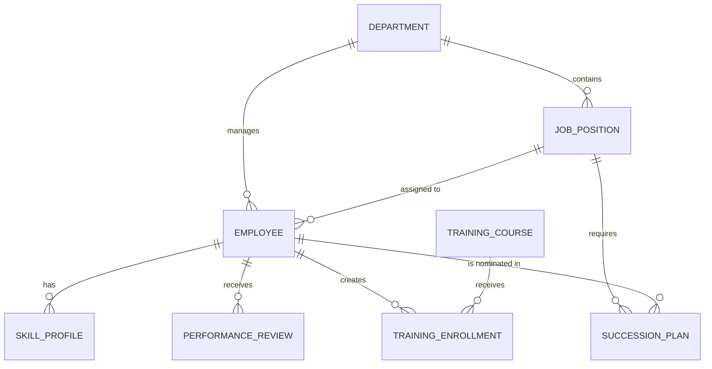

# Conceptual ERD — Talent Management System

## Mermaid Code

## Entity Description Table | Bang mo ta Entity

| # | Entity Name | Vietnamese Name | Description | Key Attributes | Main Relationships |
|---|-------------|-----------------|-------------|----------------|-------------------|
| 1 | DEPARTMENT | Phong ban | Thong tin cac phong ban | department_id, name | contains JOB_POSITION |
| 2 | JOB_POSITION | Vi tri cong viec | Thong tin chuc danh va yeu cau ky nang | job_id, title, level | assigned to EMPLOYEE |
| 3 | EMPLOYEE | Nhan vien | Ho so ca nhan cua nhan vien | employee_id, name, email | belongs to DEPARTMENT |
| 4 | SKILL_PROFILE | Ho so ky nang | Cac ky nang cua nhan vien | profile_id, skill_name, level | belongs to EMPLOYEE |
| 5 | PERFORMANCE_REVIEW | Danh gia nang luc | Phieu danh gia hieu suat | review_id, score, comments | belongs to EMPLOYEE |
| 6 | TRAINING_COURSE | Khoa dao tao | Thong tin khoa hoc phat trien nhan luc | course_id, name, duration | has many TRAINING_ENROLLMENT |
| 7 | TRAINING_ENROLLMENT | Dang ky dao tao | Ho so dang ky khoa hoc cua nhan vien | enrollment_id, status | belongs to EMPLOYEE |
| 8 | SUCCESSION_PLAN | Ke hoach ke nhiem| Ke hoach nhan su cho cac vi tri chu chot| plan_id, readiness_level | belongs to JOB_POSITION |

## Relationship Description | Mo ta Quan he

| # | From Entity | Cardinality | To Entity | Relationship Label | Business Explanation |
|---|-------------|-------------|-----------|-------------------|----------------------|
| 1 | DEPARTMENT | one-to-many | JOB_POSITION | contains | Mot phong ban bao gom nhieu vi tri cong viec. |
| 2 | DEPARTMENT | one-to-many | EMPLOYEE | manages | Mot phong ban quan ly nhieu nhan vien. |
| 3 | JOB_POSITION | one-to-many | EMPLOYEE | assigned to | Mot vi tri co the duoc gan cho nhieu nhan vien. |
| 4 | EMPLOYEE | one-to-many | SKILL_PROFILE | has | Moi nhan vien co nhieu ky nang trong ho so. |
| 5 | EMPLOYEE | one-to-many | PERFORMANCE_REVIEW | receives | Mot nhan vien nhan nhieu ban danh gia qua cac ky. |
| 6 | EMPLOYEE | one-to-many | TRAINING_ENROLLMENT | creates | Mot nhan vien co the tao nhieu don dang ky dao tao. |
| 7 | TRAINING_COURSE | one-to-many | TRAINING_ENROLLMENT | receives | Mot khoa hoc nhan nhieu luot dang ky. |
| 8 | JOB_POSITION | one-to-many | SUCCESSION_PLAN | requires | Mot vi tri chu chot can nhieu ke hoach ke nhiem. |
| 9 | EMPLOYEE | one-to-many | SUCCESSION_PLAN | is nominated in | Mot nhan vien duoc de cu trong nhieu ke hoach ke nhiem. |
