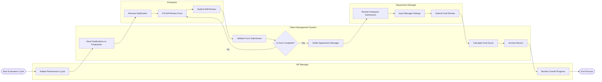

# Swimlane Diagram — Talent Management System

## Mermaid Code

## Flow Description | Mo ta luong

| Lane | Actor | Role in Flow |
|------|-------|-------------|
| 1 | HR Manager | Nguoi khoi tao ky danh gia va theo doi toan bo tien do thuc hien tren quy mo toan cong ty. |
| 2 | Talent Management System | He thong quan ly luong, thong bao, tinh toan diem so va luu tru ban ghi phieu danh gia. |
| 3 | Employee | Nguoi nhan thong bao va chu dong hoan thanh bieu mau tu danh gia tren he thong. |
| 4 | Department Manager | Nguoi danh gia cuoi cung, dua ra diem so va nhan xet xac dang cho nhan vien thuoc quyen quan ly cua minh. |
