# Action Tree — Talent Management System

## Mermaid Code

```mermaid
%%{init: {'theme': 'default'}}%%
graph TD
    Root["Talent Management System"]

    Root --> M1["Competency Management"]
    Root --> M2["Performance Management"]
    Root --> M3["Learning & Development"]
    Root --> M4["Succession Planning"]
    Root --> M5["Internal Mobility"]

    M1 --> A11["Update Skill Profile"]
    M1 --> A12["Define Job Competencies"]
    M1 --> A13["Conduct Skill Gap Analysis"]

    M2 --> A21["Configure Evaluation Cycles"]
    M2 --> A22["Submit Self-Review"]
    M2 --> A23["Submit Manager Review"]
    M2 --> A24["Generate Performance Report"]

    M3 --> A31["Manage Training Catalog"]
    M3 --> A32["Enroll in Courses"]
    M3 --> A33["Track Learning Progress"]
    M3 --> A34["Issue Certifications"]

    M4 --> A41["Identify Key Positions"]
    M4 --> A42["Assess Candidate Readiness"]
    M4 --> A43["Create Succession Plan"]

    M5 --> A51["Post Internal Jobs"]
    M5 --> A52["Browse Internal Jobs"]
    M5 --> A53["Apply for Role"]
    M5 --> A54["Review Internal Applications"]
```

## Module Description | Mo ta Module

| # | Module | Description | Actions |
|---|--------|-------------|---------|
| 1 | Competency Management | Quan ly ho so ky nang va nang luc cua toan bo nhan vien | Update Skill Profile, Define Job Competencies, Conduct Skill Gap Analysis |
| 2 | Performance Management | Quan ly qua trinh danh gia hieu suat dinh ky | Configure Evaluation Cycles, Submit Self-Review, Submit Manager Review, Generate Performance Report |
| 3 | Learning & Development | Cung cap cac khoa hoc dao tao de phat trien nhan luc | Manage Training Catalog, Enroll in Courses, Track Learning Progress, Issue Certifications |
| 4 | Succession Planning | Chuan bi doi ngu ke can cho cac vi tri chu chot | Identify Key Positions, Assess Candidate Readiness, Create Succession Plan |
| 5 | Internal Mobility | Ho tro viec di chuyen cong viec trong noi bo cong ty | Post Internal Jobs, Browse Internal Jobs, Apply for Role, Review Internal Applications |
