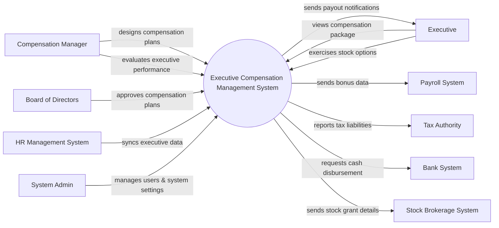

# Context Diagram — Executive Compensation Management System

## Mermaid Code

## Actor & Interaction Table | Bang Actor & Tuong tac

| # | Actor | Actor Type | Data Sent TO System | Data Received FROM System | Notes |
|---|-------|------------|---------------------|---------------------------|-------|
| 1 | Compensation Manager | Primary | Compensation plans, performance metrics | Plan analysis reports | Quan ly cac che do luong thuong |
| 2 | Executive | Primary | Stock option exercise requests | Compensation details, notifications | Lanh dao cap cao |
| 3 | Board of Directors | Primary | Plan approvals | Executive compensation summaries | Hoi dong quan tri |
| 4 | HR Management System | Supporting | Executive demographic data | Changes in executive roles | He thong nhan su chung |
| 5 | Payroll System | Supporting | Payroll processing status | Cash bonus and payout data | He thong tinh luong |
| 6 | Stock Brokerage System | Supporting | Stock transaction status | Stock grant and exercise details | He thong giao dich chung khoan |
| 7 | Tax Authority | Regulatory | Tax bracket updates | Executive tax liability reports | Co quan thue |
| 8 | Bank System | Supporting | Transaction statuses | Cash disbursement requests | He thong ngan hang |
| 9 | System Admin | Primary | System configurations, user roles | System logs, audit reports | Quan tri he thong |

## System Boundary Description | Mo ta Pham vi He thong

The Executive Compensation Management System is designed to handle complex compensation packages for top-level executives, including base salary, bonuses, and stock options. It serves as the primary platform for Compensation Managers to design plans and for the Board of Directors to approve them. The system does not directly process standard payroll or execute stock trades; instead, it integrates with external Payroll Systems and Stock Brokerage Systems. Executive data is synchronized directly from the central HR Management System.
