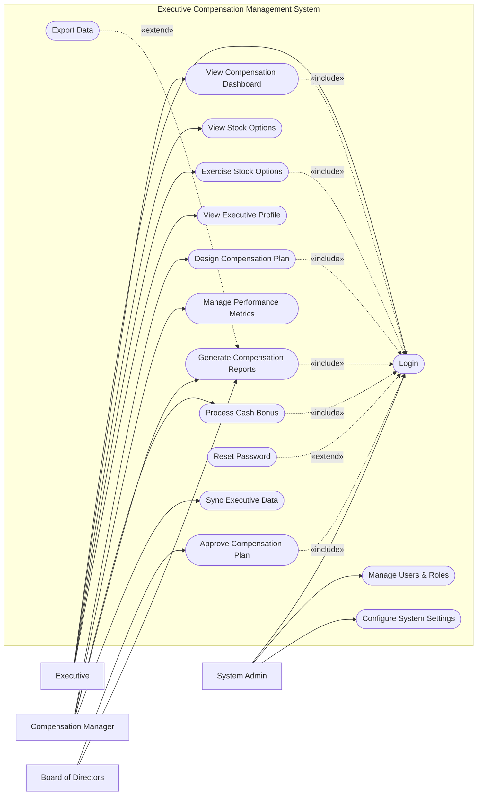

# Use Case Diagram — Executive Compensation Management System

## Mermaid Code

## Actor Table | Bang Actor

| # | Actor | Actor Type | Role Description | Related Use Cases |
|---|-------|------------|------------------|-------------------|
| 1 | Executive | Primary | Lanh dao cap cao nhan cac goi thuy lao dac biet | UC01, UC02, UC05, UC06, UC15 |
| 2 | Compensation Manager | Primary | Nguoi thiet ke va quan ly che do thuong phat | UC03, UC07, UC08, UC09, UC11 |
| 3 | Board of Directors | Primary | Hoi dong quan tri phe duyet che do luong thuong | UC04, UC09 |
| 4 | System Admin | Primary | Quan tri vien he thong, phan quyen va cai dat | UC01, UC12, UC13 |

## Use Case Table | Bang Use Case

| # | UC ID | Use Case Name | Primary Actor | Secondary Actor | Description | Priority |
|---|-------|---------------|---------------|-----------------|-------------|----------|
| 1 | UC01 | Login | Executive | | Authenticate user access | High |
| 2 | UC02 | View Compensation Dashboard | Executive | | View overall compensation package | High |
| 3 | UC03 | Design Compensation Plan | Compensation Manager | | Create new compensation packages | High |
| 4 | UC04 | Approve Compensation Plan | Board of Directors | | Review and approve proposed plans | High |
| 5 | UC05 | View Stock Options | Executive | | Check available and vested stocks | Medium |
| 6 | UC06 | Exercise Stock Options | Executive | Stock Brokerage System | Convert options to actual shares | High |
| 7 | UC07 | Manage Performance Metrics | Compensation Manager | | Set and track executive KPIs | Medium |
| 8 | UC08 | Process Cash Bonus | Compensation Manager | Payroll System | Calculate and disburse cash bonuses | High |
| 9 | UC09 | Generate Compensation Reports | Compensation Manager | | Create statistical compensation reports | Medium |
| 10| UC10 | Export Data | Compensation Manager | | Download reports as files | Low |
| 11| UC11 | Sync Executive Data | Compensation Manager | HR Management System| Pull data from the central HR system | Medium |
| 12| UC12 | Manage Users & Roles | System Admin | | Create, update, or deactivate user accounts | High |
| 13| UC13 | Configure System Settings | System Admin | | Update system-wide preferences and parameters | Medium |
| 14| UC14 | Reset Password | Executive | | Recover account access | High |
| 15| UC15 | View Executive Profile | Executive | | View personal details and role info | Low |

## Use Case Specification | Dac ta Use Case

---

### UC01 — Login

| Field | Detail |
|-------|--------|
| **UC ID** | UC01 |
| **Use Case Name** | Login |
| **Actor(s)** | Primary: Executive, Compensation Manager, Board of Directors, System Admin |
| **Description** | Cho phep nguoi dung xac thuc de dang nhap vao he thong. |
| **Precondition** | 1. Nguoi dung phai co tai khoan hop le tren he thong.  2. He thong dang hoat dong binh thuong. |
| **Main Flow** | 1. Actor mo trang dang nhap.  2. System hien thi form dang nhap.  3. Actor nhap username va password.  4. Actor nhan nut Submit.  5. System xac thuc thong tin.  6. System chuyen huong den trang chu tuong ung quyen han. |
| **Alternative Flow** | **AF1** — Quen mat khau: Neu Actor chon "Forgot Password", System kich hoat UC14 Reset Password. |
| **Exception Flow** | **EX1** — Sai thong tin: Neu xac thuc that bai, System hien thi thong bao loi va yeu cau nhap lai.  **EX2** — Tai khoan bi khoa: Neu nhap sai qua 5 lan, System khoa tai khoan va thong bao lien he Admin. |
| **Postcondition** | Nguoi dung duoc dang nhap va phien lam viec duoc khoi tao. |
| **Business Rule** | **BR1**: Mat khau phai duoc ma hoa.  **BR2**: Phien dang nhap tu dong het han sau 30 phut khong hoat dong. |

---

### UC03 — Design Compensation Plan

| Field | Detail |
|-------|--------|
| **UC ID** | UC03 |
| **Use Case Name** | Design Compensation Plan |
| **Actor(s)** | Primary: Compensation Manager |
| **Description** | Quan ly che do luong thuong thiet ke cac goi thu lao danh cho lanh dao cap cao. |
| **Precondition** | 1. Manager da dang nhap (Include UC01).  2. He thong da co du lieu ve cac khoang muc thuong (Bonus, Stock). |
| **Main Flow** | 1. Actor chon "Create New Plan".  2. System hien thi form thiet ke che do luong.  3. Actor nhap ten goi, thoi gian ap dung va cac dieu khoan muc luong/thuong.  4. Actor luu ban nhap (Draft).  5. Actor chon "Submit for Approval".  6. System chuyen trang thai thanh "Pending Approval" va gui thong bao cho Board of Directors. |
| **Alternative Flow** | **AF1** — Luu tam thoi: O buoc 4, Actor co the thoat ra ma khong gui di, he thong luu trang thai "Draft". |
| **Exception Flow** | **EX1** — Thieu thong tin bat buoc: Neu chua dien cac muc luong co ban, System bao loi va yeu cau hoan thien. |
| **Postcondition** | Goi thu lao moi duoc tao va cho phe duyet tu Hoi dong quan tri. |
| **Business Rule** | **BR1**: Moi goi thu lao phai co it nhat mot loai hinh thuong (Tien mat hoac Co phieu).  **BR2**: Chi khi o trang thai Draft, goi thu lao moi duoc phep chinh sua. |

---

### UC04 — Approve Compensation Plan

| Field | Detail |
|-------|--------|
| **UC ID** | UC04 |
| **Use Case Name** | Approve Compensation Plan |
| **Actor(s)** | Primary: Board of Directors |
| **Description** | Hoi dong quan tri xem xet va phe duyet che do luong thuong da duoc thiet ke. |
| **Precondition** | 1. Board of Directors da dang nhap (Include UC01).  2. Ton tai it nhat mot goi thu lao dang o trang thai "Pending Approval". |
| **Main Flow** | 1. Actor vao danh sach "Pending Plans".  2. System hien thi danh sach cac goi thu lao can duyet.  3. Actor chon mot goi de xem chi tiet.  4. System hien thi chi tiet cac dieu khoan, co cơ cấu lương, thưởng, và cổ phiếu.  5. Actor nhan "Approve".  6. System cap nhat trang thai thanh "Approved" va thong bao cho Compensation Manager. |
| **Alternative Flow** | **AF1** — Tu choi: O buoc 5, Actor chon "Reject" va nhap ly do. System cap nhat trang thai "Rejected" va thong bao ve cho Manager. |
| **Exception Flow** | **EX1** — Goi thu lao da bi xoa: Neu Manager da rut lai goi do truoc khi duyet, System bao loi "Plan no longer available". |
| **Postcondition** | Trang thai cua che do luong thuong duoc cap nhat thanh Approved hoac Rejected. |
| **Business Rule** | **BR1**: Mot plan sau khi Approved se khong the bi xoa.  **BR2**: Ke hoach Rejected co the duoc Manager chinh sua va gui lai. |

---

### UC06 — Exercise Stock Options

| Field | Detail |
|-------|--------|
| **UC ID** | UC06 |
| **Use Case Name** | Exercise Stock Options |
| **Actor(s)** | Primary: Executive | Secondary: Stock Brokerage System |
| **Description** | Lanh dao tien hanh thuc thi quyen mua co phieu cua minh khi den han. |
| **Precondition** | 1. Executive da dang nhap (Include UC01).  2. Co so luong co phieu hop le (Vested) co the thuc thi. |
| **Main Flow** | 1. Actor truy cap vao muc "Stock Options".  2. System hien thi danh sach cac co phieu da den han (Vested).  3. Actor nhap so luong co phieu muon thuc thi va nhan nut "Exercise".  4. System hien thi xac nhan ve gia tri va thue phai nop.  5. Actor dong y xac nhan.  6. System gui yeu cau toi Stock Brokerage System va cap nhat so du. |
| **Alternative Flow** | **AF1** — Huy bo: O buoc 4, Actor co the chon "Cancel" de quay lai. |
| **Exception Flow** | **EX1** — Vuot qua so luong cho phep: Neu Actor nhap so luong lon hon so luong kha dung, System bao loi va ngan chan giao dich.  **EX2** — Loi ket noi he thong giao dich: Neu Stock Brokerage System khong phan hoi, System thong bao loi va cho phep thu lai sau. |
| **Postcondition** | Yeu cau thuc thi co phieu duoc gui di, so luong kha dung bi tru tuong ung. |
| **Business Rule** | **BR1**: Chi co the thuc thi (exercise) nhung co phieu da vested.  **BR2**: Thue phai duoc tam tinh ngay tai thoi diem thuc thi theo luat dinh. |

---

### UC08 — Process Cash Bonus

| Field | Detail |
|-------|--------|
| **UC ID** | UC08 |
| **Use Case Name** | Process Cash Bonus |
| **Actor(s)** | Primary: Compensation Manager | Secondary: Payroll System |
| **Description** | Tinh toan va tien hanh phan bo thuong tien mat dua tren hieu suat cua lanh dao. |
| **Precondition** | 1. Compensation Manager da dang nhap (Include UC01).  2. Da co ket qua danh gia nang luc hoac KPI dat chuan. |
| **Main Flow** | 1. Actor chon "Process Bonus".  2. System hien thi danh sach lanh dao du dieu kien nhan thuong ke cung voi muc thuong de xuat.  3. Actor kiem tra va dieu chinh muc thuong (neu can).  4. Actor nhan "Submit for Payment".  5. System tong hop du lieu va gui sang Payroll System de thuc hien chi tra.  6. System chuyen trang thai sang "Processing" va luu lich su. |
| **Alternative Flow** | **AF1** — Loai tru ca nhan: Actor co the bo chon mot vai lanh dao ra khoi dot tra thuong neu co ly do dac biet. |
| **Exception Flow** | **EX1** — Chua duyet ke hoach KPI: Neu KPI chua duoc xac nhan chinh thuc, System chan qua trinh tinh thuong va bao loi. |
| **Postcondition** | Du lieu thuong tien mat duoc gui den Payroll System de xu ly. |
| **Business Rule** | **BR1**: Muc thuong dieu chinh khong duoc vuot qua muc tran da quy dinh trong Compensation Plan.  **BR2**: Moi lan gui du lieu thanh toan deu phai luu vet kiem toan (Audit Log). |
