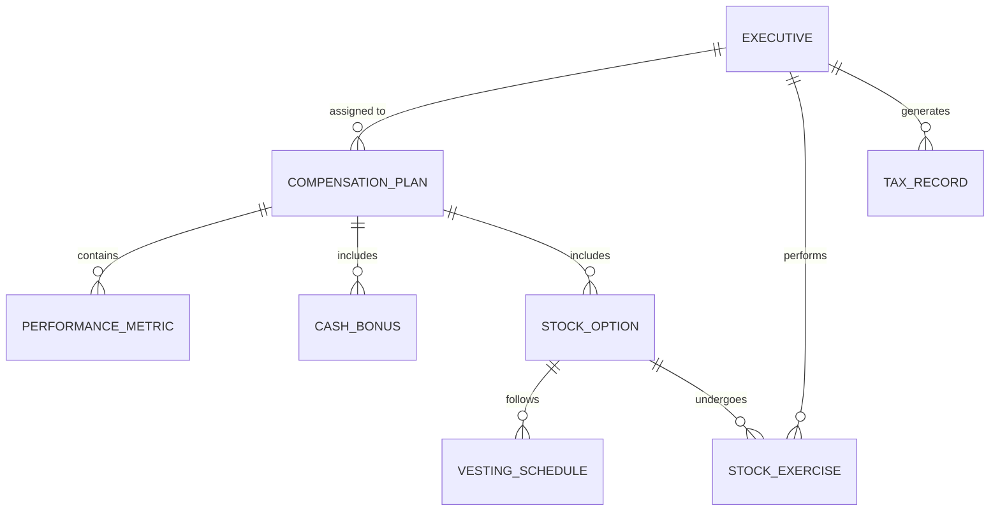

# Conceptual ERD — Executive Compensation Management System

## Mermaid Code

## Entity Description Table | Bang mo ta Entity

| # | Entity Name | Vietnamese Name | Description | Key Attributes | Main Relationships |
|---|-------------|-----------------|-------------|----------------|-------------------|
| 1 | EXECUTIVE | Lanh dao | Ho so thong tin cua cac lanh dao cap cao | exec_id, name, level, base_salary | performs STOCK_EXERCISE |
| 2 | COMPENSATION_PLAN | Goi thu lao | Che do luong thuong duoc thiet ke rieng | plan_id, title, status | assigned to EXECUTIVE |
| 3 | PERFORMANCE_METRIC | Chi tieu hieu suat | Cac tieu chi de tinh thuong | metric_id, description, target_value | belongs to COMPENSATION_PLAN |
| 4 | CASH_BONUS | Thuong tien mat | Cac khoan tien thuong them | bonus_id, amount, condition | belongs to COMPENSATION_PLAN |
| 5 | STOCK_OPTION | Quyen mua co phieu | Cac khoan thuong co phieu | option_id, grant_date, total_shares | includes VESTING_SCHEDULE |
| 6 | VESTING_SCHEDULE | Lich trinh giai ngan | Thoi gian co phieu duoc phep giao dich | schedule_id, vest_date, vest_percent | belongs to STOCK_OPTION |
| 7 | STOCK_EXERCISE | Giao dich thuc thi | Lich su lanh dao su dung quyen mua co phieu | exercise_id, exercise_date, shares | belongs to EXECUTIVE |
| 8 | TAX_RECORD | Ban ghi thue | Cac khoan thue phat sinh tu tien thuong va co phieu | tax_id, amount, tax_type | belongs to EXECUTIVE |

## Relationship Description | Mo ta Quan he

| # | From Entity | Cardinality | To Entity | Relationship Label | Business Explanation |
|---|-------------|-------------|-----------|-------------------|----------------------|
| 1 | EXECUTIVE | one-to-many | COMPENSATION_PLAN | assigned to | Mot lanh dao co the duoc phan bo nhieu goi thu lao qua cac nam. |
| 2 | COMPENSATION_PLAN | one-to-many | PERFORMANCE_METRIC | contains | Mot goi thu lao bao gom nhieu tieu chi danh gia hieu suat. |
| 3 | COMPENSATION_PLAN | one-to-many | CASH_BONUS | includes | Mot goi thu lao co the chua nhieu khoan thuong tien mat khac nhau. |
| 4 | COMPENSATION_PLAN | one-to-many | STOCK_OPTION | includes | Mot goi thu lao co the bao gom nhieu khoan thuong co phieu. |
| 5 | STOCK_OPTION | one-to-many | VESTING_SCHEDULE | follows | Mot khoan thuong co phieu co the co lich trinh giai ngan thanh nhieu dot. |
| 6 | EXECUTIVE | one-to-many | STOCK_EXERCISE | performs | Mot lanh dao co the thuc hien giao dich mua co phieu nhieu lan. |
| 7 | STOCK_OPTION | one-to-many | STOCK_EXERCISE | undergoes | Mot quyen mua co phieu co the duoc thuc thi nhieu lan tung phan. |
| 8 | EXECUTIVE | one-to-many | TAX_RECORD | generates | Mot lanh dao phat sinh nhieu ban ghi thue trong suot qua trinh nhan thuong. |
