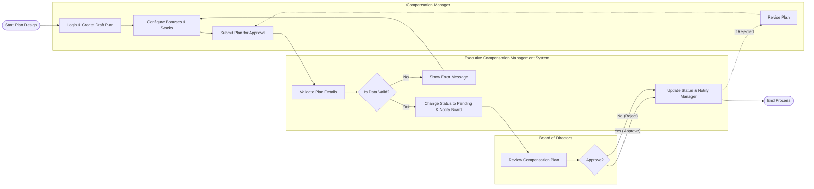

# Swimlane Diagram — Executive Compensation Management System

## Mermaid Code

## Flow Description | Mo ta luong

| Lane | Actor | Role in Flow |
|------|-------|-------------|
| 1 | Compensation Manager | Nguoi thiet ke che do luong thuong va gui yeu cau phe duyet len Hoi dong quan tri. |
| 2 | Executive Compensation Management System | He thong kiem tra tinh hop le cua thong tin, cap nhat trang thai va gui thong bao. |
| 3 | Board of Directors | Xem xet va quyet dinh phe duyet hoac tu choi ke hoach luong thuong cua lanh dao. |
