# Action Tree — Executive Compensation Management System

## Mermaid Code

```mermaid
%%{init: {'theme': 'default'}}%%
graph TD
    Root["Executive Compensation Management System"]

    Root --> M1["Plan Design"]
    Root --> M2["Performance Management"]
    Root --> M3["Bonus Disbursement"]
    Root --> M4["Stock Option Management"]
    Root --> M5["Reporting & Compliance"]

    M1 --> A11["Create Compensation Plan"]
    M1 --> A12["Define Salary Structures"]
    M1 --> A13["Submit for Approval"]
    M1 --> A14["Approve/Reject Plans"]

    M2 --> A21["Set Performance Targets"]
    M2 --> A22["Input KPI Achievements"]
    M2 --> A23["Evaluate Metric Outcomes"]

    M3 --> A31["Calculate Cash Bonus"]
    M3 --> A32["Adjust Bonus Amounts"]
    M3 --> A33["Send to Payroll System"]

    M4 --> A41["View Stock Grants"]
    M4 --> A42["Track Vesting Schedule"]
    M4 --> A43["Exercise Stock Options"]
    M4 --> A44["Sync with Brokerage"]

    M5 --> A51["Generate Compensation Summaries"]
    M5 --> A52["Calculate Estimated Taxes"]
    M5 --> A53["Export Compliance Data"]
```

## Module Description | Mo ta Module

| # | Module | Description | Actions |
|---|--------|-------------|---------|
| 1 | Plan Design | Thiet ke va phe duyet cac goi luong thuong dac biet | Create Compensation Plan, Define Salary Structures, Submit for Approval, Approve/Reject Plans |
| 2 | Performance Management | Quan ly KPI va nang luc cua lanh dao | Set Performance Targets, Input KPI Achievements, Evaluate Metric Outcomes |
| 3 | Bonus Disbursement | Tinh toan va phan bo tien thuong | Calculate Cash Bonus, Adjust Bonus Amounts, Send to Payroll System |
| 4 | Stock Option Management | Quan ly co phieu, lich trinh giai ngan va quyen mua | View Stock Grants, Track Vesting Schedule, Exercise Stock Options, Sync with Brokerage |
| 5 | Reporting & Compliance | Bao cao thong ke va tuan thu thue | Generate Compensation Summaries, Calculate Estimated Taxes, Export Compliance Data |
