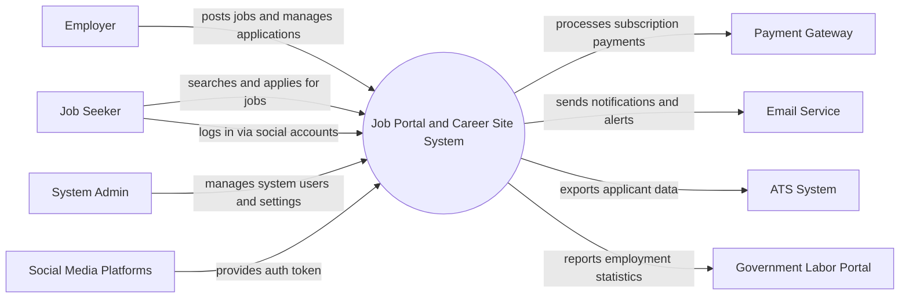

# Context Diagram — Job Portal and Career Site System

## Mermaid Code

## Actor & Interaction Table | Bang Actor & Tuong tac

| # | Actor | Actor Type | Data Sent TO System | Data Received FROM System | Notes |
|---|-------|------------|---------------------|---------------------------|-------|
| 1 | Job Seeker | Primary | Profile info, resume, job applications | Job alerts, application status, recommendations | Nguoi tim viec |
| 2 | Employer | Primary | Company profile, job postings, decisions | Applicant profiles, resumes | Nha tuyen dung |
| 3 | System Admin | Primary | System configurations, user role updates | System reports, error logs | Quan tri he thong |
| 4 | Payment Gateway | Supporting | Payment confirmation, transaction ID | Payment details, billing info | Cong thanh toan |
| 5 | Email Service | Supporting | Delivery status | Email templates, recipient lists | Dich vu gui email |
| 6 | Social Media Platforms | Supporting | OAuth tokens, public profile data | Authentication requests | Dang nhap qua mang xa hoi |
| 7 | ATS System | Supporting | Integration status | Exported applicant data | He thong quan ly ung vien ngoai |
| 8 | Government Labor Portal | Regulatory | Compliance guidelines | Employment statistics, job posting data | Cong thong tin lao dong |

## System Boundary Description | Mo ta Pham vi He thong

The Job Portal and Career Site System provides a centralized platform for Job Seekers to find employment and Employers to post jobs and recruit candidates. The system handles user profiles, job postings, resume parsing, and application tracking internally. However, it relies on external Payment Gateways for processing subscriptions and external Email Services for sending notifications. Third-party ATS Systems can integrate to extract application data, while authentication can be partially delegated to Social Media Platforms.
