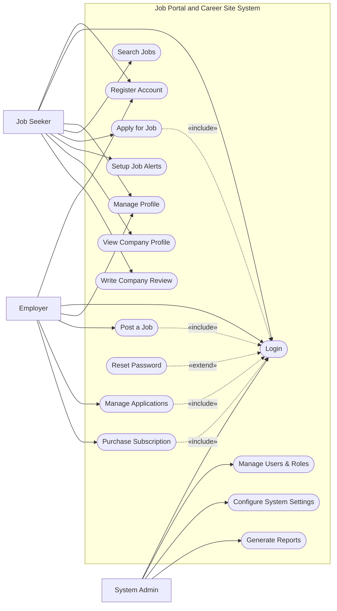

# Use Case Diagram — Job Portal and Career Site System

## Mermaid Code

## Actor Table | Bang Actor

| # | Actor | Actor Type | Role Description | Related Use Cases |
|---|-------|------------|------------------|-------------------|
| 1 | Job Seeker | Primary | Nguoi tim viec tao ho so, tim kiem va ung tuyen viec lam | UC01, UC02, UC03, UC04, UC05, UC06, UC09, UC11 |
| 2 | Employer | Primary | Nha tuyen dung dang tin viec lam va quan ly ung vien | UC01, UC02, UC03, UC07, UC08, UC10 |
| 3 | System Admin | Primary | Quan tri vien he thong, phan quyen va cai dat | UC02, UC12, UC13, UC14 |

## Use Case Table | Bang Use Case

| # | UC ID | Use Case Name | Primary Actor | Secondary Actor | Description | Priority |
|---|-------|---------------|---------------|-----------------|-------------|----------|
| 1 | UC01 | Register Account | Job Seeker, Employer | | Create a new user account | High |
| 2 | UC02 | Login | Job Seeker, Employer, System Admin | | Authenticate user access | High |
| 3 | UC03 | Manage Profile | Job Seeker, Employer | | Update personal or company profile | Medium |
| 4 | UC04 | Search Jobs | Job Seeker | | Search for jobs based on criteria | High |
| 5 | UC05 | Apply for Job | Job Seeker | | Submit application for a specific job | High |
| 6 | UC06 | Setup Job Alerts | Job Seeker | | Configure email alerts for new jobs | Low |
| 7 | UC07 | Post a Job | Employer | | Create and publish a new job vacancy | High |
| 8 | UC08 | Manage Applications | Employer | | Review and update candidate status | High |
| 9 | UC09 | View Company Profile | Job Seeker | | View details about an employer | Low |
| 10| UC10 | Purchase Subscription | Employer | Payment Gateway | Buy premium plans for job posting | High |
| 11| UC11 | Write Company Review | Job Seeker | | Review an employer company | Low |
| 12| UC12 | Manage Users & Roles | System Admin | | Create, update, or deactivate users | High |
| 13| UC13 | Configure System Settings | System Admin | | Update system-wide configurations | Medium |
| 14| UC14 | Generate Reports | System Admin | | Export data and analytical reports | Medium |
| 15| UC15 | Reset Password | Job Seeker, Employer | | Recover account access | High |

## Use Case Specification | Dac ta Use Case

---

### UC02 — Login

| Field | Detail |
|-------|--------|
| **UC ID** | UC02 |
| **Use Case Name** | Login |
| **Actor(s)** | Primary: Job Seeker, Employer, System Admin |
| **Description** | Cho phep nguoi dung xac thuc de dang nhap vao he thong. |
| **Precondition** | 1. Nguoi dung phai co tai khoan hop le tren he thong.  2. He thong dang hoat dong binh thuong. |
| **Main Flow** | 1. Actor mo trang dang nhap.  2. System hien thi form dang nhap.  3. Actor nhap email va password.  4. Actor nhan nut Submit.  5. System xac thuc thong tin.  6. System chuyen huong den trang dashboard tuong ung quyen han. |
| **Alternative Flow** | **AF1** — Quen mat khau: Neu Actor chon "Forgot Password", System kich hoat UC15 Reset Password.  **AF2** — Dang nhap qua MXH: Actor chon dang nhap qua Google/LinkedIn, System chuyen huong xac thuc qua thiet bi thu 3 roi dang nhap thanh cong. |
| **Exception Flow** | **EX1** — Sai thong tin: Neu xac thuc that bai, System hien thi thong bao loi va yeu cau nhap lai.  **EX2** — Tai khoan bi khoa: Neu nhap sai qua 5 lan, System khoa tai khoan va thong bao lien he Admin. |
| **Postcondition** | Nguoi dung duoc dang nhap va phien lam viec duoc khoi tao. |
| **Business Rule** | **BR1**: Mat khau phai duoc ma hoa.  **BR2**: Phien dang nhap tu dong het han sau 30 phut khong hoat dong. |

---

### UC05 — Apply for Job

| Field | Detail |
|-------|--------|
| **UC ID** | UC05 |
| **Use Case Name** | Apply for Job |
| **Actor(s)** | Primary: Job Seeker |
| **Description** | Cho phep Job Seeker nop don ung tuyen cho mot cong viec cu the. |
| **Precondition** | 1. Job Seeker da dang nhap (Include UC02).  2. Cong viec (Job Posting) van dang o trang thai mo (Open). |
| **Main Flow** | 1. Actor xem chi tiet mot cong viec va nhan "Apply Now".  2. System hien thi form ung tuyen cung ho so mac dinh.  3. Actor cap nhat resume, cover letter neu can va nhan Submit.  4. System luu thong tin ung tuyen.  5. System gui email thong bao cho Employer va Job Seeker.  6. System hien thi thong bao thanh cong cho Actor. |
| **Alternative Flow** | **AF1** — Huy ung tuyen: Truoc khi Submit, Actor chon "Cancel", System quay lai trang chi tiet cong viec ma khong luu. |
| **Exception Flow** | **EX1** — Cong viec da dong: Neu Employer vua dong job, System hien thi thong bao "This job is no longer accepting applications".  **EX2** — Da ung tuyen roi: Neu Job Seeker da tung ung tuyen vao job nay, System thong bao "You have already applied for this job". |
| **Postcondition** | Don ung tuyen duoc ghi nhan vao he thong va lien ket voi cong viec. |
| **Business Rule** | **BR1**: Moi ung vien chi duoc ung tuyen 1 lan cho 1 tin tuyen dung.  **BR2**: File CV upload phai co dinh dang PDF, DOCX va duoi 5MB. |

---

### UC07 — Post a Job

| Field | Detail |
|-------|--------|
| **UC ID** | UC07 |
| **Use Case Name** | Post a Job |
| **Actor(s)** | Primary: Employer |
| **Description** | Cho phep Employer tao va dang mot tin tuyen dung moi tren he thong. |
| **Precondition** | 1. Employer da dang nhap (Include UC02).  2. Employer co goi dang ky (Subscription) con han va con luot dang tin. |
| **Main Flow** | 1. Actor chon "Post a Job" tu dashboard.  2. System hien thi form tao tin tuyen dung.  3. Actor nhap tieu de, mo ta, yeu cau, muc luong va dia diem.  4. Actor nhan "Publish".  5. System kiem tra tinh hop le va luot dang tin con lai.  6. System luu tin tuyen dung, chuyen trang thai "Published" va tru 1 luot dang. |
| **Alternative Flow** | **AF1** — Luu nhap (Save Draft): O buoc 4, Actor nhan "Save as Draft", System luu tin o trang thai "Draft" va khong tru luot dang tin. |
| **Exception Flow** | **EX1** — Het luot dang tin: O buoc 5, neu Employer het luot, System chan va hien thi nut nang cap goi (Include UC10 Purchase Subscription).  **EX2** — Thieu thong tin bat buoc: Neu Actor de trong cac truong bat buoc, System canh bao bang mau do. |
| **Postcondition** | Tin tuyen dung duoc luu vao he thong va hien thi cho Job Seeker tim kiem. |
| **Business Rule** | **BR1**: Tin dang mac dinh hien thi trong 30 ngay truoc khi het han.  **BR2**: Cac cong viec vi pham chinh sach se bi Admin xoa bo ma khong can bao truoc. |

---

### UC08 — Manage Applications

| Field | Detail |
|-------|--------|
| **UC ID** | UC08 |
| **Use Case Name** | Manage Applications |
| **Actor(s)** | Primary: Employer |
| **Description** | Cho phep Employer xem xet, loc va chuyen trang thai don ung tuyen cua ung vien. |
| **Precondition** | 1. Employer da dang nhap (Include UC02).  2. Employer co it nhat mot tin tuyen dung dang co ung vien nop don. |
| **Main Flow** | 1. Actor truy cap trang "Application Tracking".  2. System hien thi danh sach ung vien theo tung tin tuyen dung.  3. Actor nhan vao mot ung vien de xem CV va Cover Letter.  4. Actor thay doi trang thai ung vien (vd: tu "New" sang "Interviewing").  5. System luu trang thai moi va gui email thong bao (neu duoc cau hinh). |
| **Alternative Flow** | **AF1** — Tai CV: Actor chon "Download Resume", System tai file CV cua ung vien ve may. |
| **Exception Flow** | **EX1** — Khong co quyen truy cap: Neu Actor truy cap vao don ung tuyen cua cong ty khac bang link truc tiep, System hien thi loi 403 Forbidden. |
| **Postcondition** | Trang thai cua don ung tuyen duoc cap nhat trong co so du lieu. |
| **Business Rule** | **BR1**: Ung vien co the xem duoc trang thai don cua minh (vd: "Viewed", "Rejected").  **BR2**: Chi nguoi tao tin hoac tai khoan cung cong ty moi co the quan ly ung vien. |

---

### UC10 — Purchase Subscription

| Field | Detail |
|-------|--------|
| **UC ID** | UC10 |
| **Use Case Name** | Purchase Subscription |
| **Actor(s)** | Primary: Employer | Secondary: Payment Gateway |
| **Description** | Cho phep Employer mua hoac gia han goi dich vu (so luot dang tin, tinh nang premium). |
| **Precondition** | 1. Employer da dang nhap (Include UC02). |
| **Main Flow** | 1. Actor chon "Pricing Plans".  2. System hien thi cac goi dich vu hien co.  3. Actor chon goi va nhan "Buy Now".  4. System chuyen huong den Payment Gateway.  5. Actor nhap thong tin the va thanh toan.  6. Payment Gateway xu ly va tra ve trang thai thanh cong.  7. System cap nhat goi dich vu cho Employer, tao hoa don va gui email xac nhan. |
| **Alternative Flow** | **AF1** — Su dung ma giam gia: O buoc 3, Actor nhap promo code, System tinh toan lai tong tien truoc khi chuyen den cong thanh toan. |
| **Exception Flow** | **EX1** — Thanh toan that bai: Tai buoc 6, neu the bi tu choi, Payment Gateway tra ve loi, System hien thi thong bao thanh toan khong thanh cong va yeu cau thu lai. |
| **Postcondition** | Tai khoan cua Employer duoc cap nhat goi dich vu moi. |
| **Business Rule** | **BR1**: Goi dich vu co thoi han tinh tu ngay thanh toan thanh cong.  **BR2**: Hoa don dien tu phai duoc luu lai trong he thong de doi chieu. |
