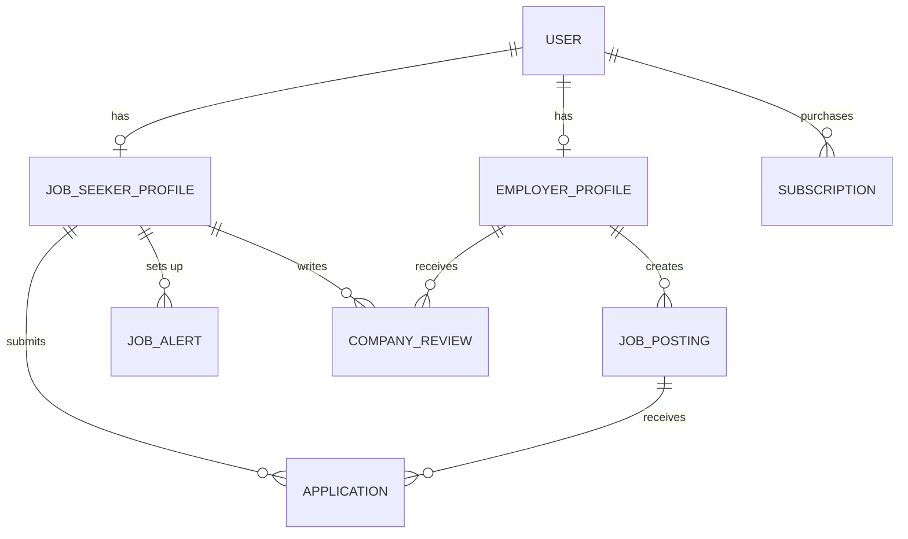

# Conceptual ERD — Job Portal and Career Site System

## Mermaid Code

## Entity Description Table | Bang mo ta Entity

| # | Entity Name | Vietnamese Name | Description | Key Attributes | Main Relationships |
|---|-------------|-----------------|-------------|----------------|-------------------|
| 1 | USER | Nguoi dung | Thong tin tai khoan cua moi nguoi dung tren he thong | user_id, email, password, role | has JOB_SEEKER_PROFILE, has EMPLOYER_PROFILE |
| 2 | JOB_SEEKER_PROFILE | Ho so nguoi tim viec | Chi tiet ca nhan va resume cua ung vien | profile_id, full_name, resume_url | submits APPLICATION |
| 3 | EMPLOYER_PROFILE | Ho so nha tuyen dung | Thong tin chi tiet ve cong ty / to chuc tuyen dung | employer_id, company_name, description | creates JOB_POSTING |
| 4 | JOB_POSTING | Tin tuyen dung | Thong tin cong viec dang duoc tuyen | job_id, title, location, status | receives APPLICATION |
| 5 | APPLICATION | Don ung tuyen | Thong tin ung vien nop vao mot cong viec | application_id, apply_date, status | belongs to JOB_SEEKER_PROFILE |
| 6 | SUBSCRIPTION | Goi dang ky dich vu | Chi tiet giao dich mua goi premium cua Employer | subscription_id, plan_type, expire_date | belongs to USER |
| 7 | JOB_ALERT | Thong bao viec lam | Cau hinh nhan thong bao viec lam moi cua Job Seeker | alert_id, keywords, frequency | belongs to JOB_SEEKER_PROFILE |
| 8 | COMPANY_REVIEW | Danh gia cong ty | Nhan xet cua ung vien ve nha tuyen dung | review_id, rating, comment | belongs to EMPLOYER_PROFILE |

## Relationship Description | Mo ta Quan he

| # | From Entity | Cardinality | To Entity | Relationship Label | Business Explanation |
|---|-------------|-------------|-----------|-------------------|----------------------|
| 1 | USER | one-to-one | JOB_SEEKER_PROFILE | has | Mot tai khoan nguoi dung co the co mot ho so tim viec. |
| 2 | USER | one-to-one | EMPLOYER_PROFILE | has | Mot tai khoan nguoi dung co the co mot ho so nha tuyen dung. |
| 3 | USER | one-to-many | SUBSCRIPTION | purchases | Mot nguoi dung (Employer) co the mua nhieu goi dich vu qua cac thoi ky. |
| 4 | EMPLOYER_PROFILE | one-to-many | JOB_POSTING | creates | Mot nha tuyen dung co the tao nhieu tin tuyen dung. |
| 5 | JOB_SEEKER_PROFILE | one-to-many | APPLICATION | submits | Mot nguoi tim viec co the nop nhieu don ung tuyen. |
| 6 | JOB_POSTING | one-to-many | APPLICATION | receives | Mot tin tuyen dung co the nhan duoc nhieu don ung tuyen. |
| 7 | JOB_SEEKER_PROFILE | one-to-many | JOB_ALERT | sets up | Mot nguoi tim viec co the tao nhieu thong bao viec lam voi tu khoa khac nhau. |
| 8 | JOB_SEEKER_PROFILE | one-to-many | COMPANY_REVIEW | writes | Mot nguoi tim viec co the viet nhieu danh gia cho cac cong ty khac nhau. |
| 9 | EMPLOYER_PROFILE | one-to-many | COMPANY_REVIEW | receives | Mot nha tuyen dung co the nhan duoc nhieu danh gia tu cac ung vien. |
