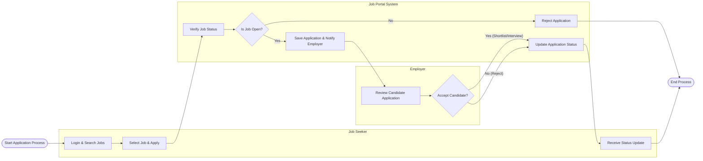

# Swimlane Diagram — Job Portal and Career Site System

## Mermaid Code

## Flow Description | Mo ta luong

| Lane | Actor | Role in Flow |
|------|-------|-------------|
| 1 | Job Seeker | Nguoi dung chu dong tim kiem cong viec, nop don ung tuyen va theo doi ket qua. |
| 2 | Job Portal System | He thong kiem tra tinh trang cong viec, luu tru don ung tuyen va dieu phoi thong bao giua cac ben. |
| 3 | Employer | Nha tuyen dung nhan thong bao, xem xet ho so ung vien va quyet dinh thay doi trang thai ung tuyen. |
