# Action Tree — Job Portal and Career Site System

## Mermaid Code

```mermaid
%%{init: {'theme': 'default'}}%%
graph TD
    Root["Job Portal and Career Site System"]

    Root --> M1["User Management"]
    Root --> M2["Job Management"]
    Root --> M3["Application Management"]
    Root --> M4["Subscription & Billing"]
    Root --> M5["System Administration"]

    M1 --> A11["Register & Login"]
    M1 --> A12["Manage Job Seeker Profile"]
    M1 --> A13["Manage Employer Profile"]
    M1 --> A14["Write Company Review"]

    M2 --> A21["Post New Job"]
    M2 --> A22["Search Job Postings"]
    M2 --> A23["Setup Job Alerts"]
    M2 --> A24["Close Job Posting"]

    M3 --> A31["Apply for a Job"]
    M3 --> A32["Review Candidates"]
    M3 --> A33["Update Application Status"]
    M3 --> A34["Download Resumes"]

    M4 --> A41["View Pricing Plans"]
    M4 --> A42["Purchase Subscription"]
    M4 --> A43["View Invoice History"]

    M5 --> A51["Manage User Accounts"]
    M5 --> A52["Configure Job Categories"]
    M5 --> A53["Generate Platform Reports"]
```

## Module Description | Mo ta Module

| # | Module | Description | Actions |
|---|--------|-------------|---------|
| 1 | User Management | Quan ly tai khoan, ho so cua nguoi tim viec va nha tuyen dung. | Register & Login, Manage Job Seeker Profile, Manage Employer Profile, Write Company Review |
| 2 | Job Management | Dang tai, tim kiem, quan ly tin tuyen dung va canh bao viec lam. | Post New Job, Search Job Postings, Setup Job Alerts, Close Job Posting |
| 3 | Application Management | Xu ly toan quy trinh ung tuyen tu nop don den duyet ho so. | Apply for a Job, Review Candidates, Update Application Status, Download Resumes |
| 4 | Subscription & Billing | Quan ly cac goi dich vu tra phi danh cho nha tuyen dung. | View Pricing Plans, Purchase Subscription, View Invoice History |
| 5 | System Administration | Module cho Admin quan tri he thong, phan quyen va thong ke. | Manage User Accounts, Configure Job Categories, Generate Platform Reports |
