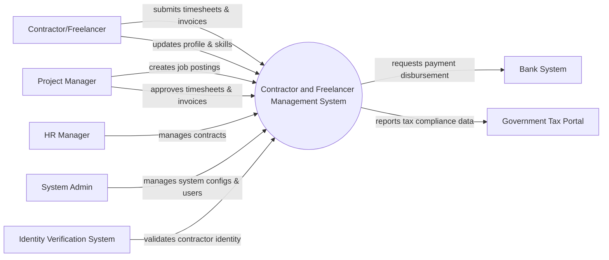

# Context Diagram — Contractor and Freelancer Management System

## Mermaid Code

## Actor & Interaction Table | Bang Actor & Tuong tac

| # | Actor | Actor Type | Data Sent TO System | Data Received FROM System | Notes |
|---|-------|------------|---------------------|---------------------------|-------|
| 1 | Contractor/Freelancer | Primary | Profile data, timesheets, invoices | Job matches, contract details, payment status | Nguoi lao dong tu do |
| 2 | Project Manager | Primary | Job postings, timesheet approvals, invoice approvals | Submitted timesheets, invoices, contractor profiles | Nguoi quan ly du an |
| 3 | HR Manager | Primary | Contract terms, compliance data | Contract status, HR reports | Quan ly nhan su |
| 4 | System Admin | Primary | System configurations, user roles | System logs, audit reports | Quan tri he thong |
| 5 | Identity Verification System | Supporting | Identity verification status | Identity documents | He thong xac thuc danh tinh |
| 6 | Bank System | Supporting | Payment transaction status | Payment disbursement requests | He thong ngan hang |
| 7 | Government Tax Portal | Regulatory | Tax policy updates | Tax deduction reports | Cong thue chinh phu |

## System Boundary Description | Mo ta Pham vi He thong

The Contractor and Freelancer Management System (CFMS) is designed to streamline the lifecycle of external workforce management, including job posting, contract signing, timesheet logging, and invoice generation. It provides dedicated interfaces for Contractors, Project Managers, and HR Managers. The system interfaces with external Identity Verification Systems for background checks and Bank Systems for initiating payments. It does not act as a direct payment gateway itself but orchestrates the workflow and maintains compliance data for the Government Tax Portal.
