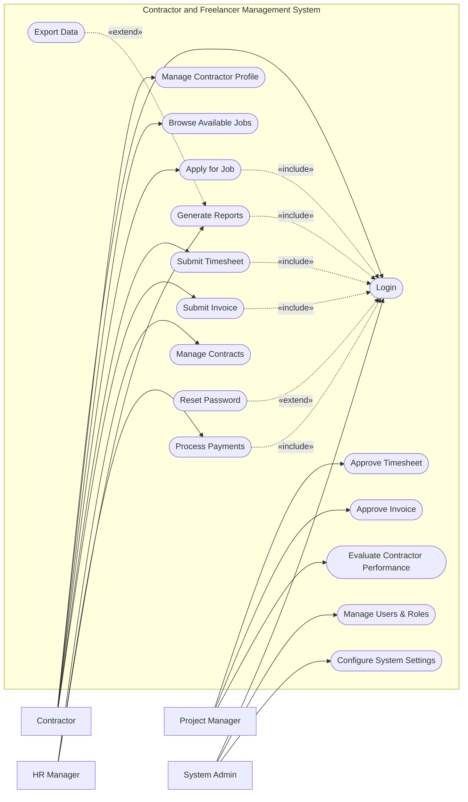

# Use Case Diagram — Contractor and Freelancer Management System

## Mermaid Code

## Actor Table | Bang Actor

| # | Actor | Actor Type | Role Description | Related Use Cases |
|---|-------|------------|------------------|-------------------|
| 1 | Contractor | Primary | Freelancer thuc hien cong viec theo hop dong | UC01, UC02, UC03, UC04, UC06, UC08 |
| 2 | Project Manager | Primary | Nguoi quan ly du an, giao viec va duyet tien do | UC07, UC09, UC11 |
| 3 | HR Manager | Primary | Nhan su quan ly hop dong, thanh toan va bao cao | UC05, UC10, UC12 |
| 4 | System Admin | Primary | Quan tri vien he thong, phan quyen va cai dat | UC01, UC15, UC16 |

## Use Case Table | Bang Use Case

| # | UC ID | Use Case Name | Primary Actor | Secondary Actor | Description | Priority |
|---|-------|---------------|---------------|-----------------|-------------|----------|
| 1 | UC01 | Login | Contractor | | Authenticate user access | High |
| 2 | UC02 | Manage Contractor Profile | Contractor | | Update personal information and skills | Medium |
| 3 | UC03 | Browse Available Jobs | Contractor | | View job postings for freelancers | Medium |
| 4 | UC04 | Apply for Job | Contractor | | Submit application for a project | High |
| 5 | UC05 | Manage Contracts | HR Manager | | Create, update, or terminate contracts | High |
| 6 | UC06 | Submit Timesheet | Contractor | | Log hours worked on a project | High |
| 7 | UC07 | Approve Timesheet | Project Manager | | Review and approve logged hours | High |
| 8 | UC08 | Submit Invoice | Contractor | | Generate invoice for completed work | High |
| 9 | UC09 | Approve Invoice | Project Manager | | Validate and approve submitted invoices | High |
| 10| UC10 | Process Payments | HR Manager | Bank System | Initiate payment disbursement | High |
| 11| UC11 | Evaluate Contractor Performance | Project Manager | | Rate contractor work quality | Medium |
| 12| UC12 | Generate Reports | HR Manager | | Create statistical system reports | Medium |
| 13| UC13 | Reset Password | Contractor | | Recover account access | High |
| 14| UC14 | Export Data | HR Manager | | Download reports as files | Low |
| 15| UC15 | Manage Users & Roles | System Admin | | Create or update user accounts | High |
| 16| UC16 | Configure System Settings | System Admin | | Update system-wide preferences | Medium |

## Use Case Specification | Dac ta Use Case

---

### UC01 — Login

| Field | Detail |
|-------|--------|
| **UC ID** | UC01 |
| **Use Case Name** | Login |
| **Actor(s)** | Primary: Contractor, Project Manager, HR Manager, System Admin |
| **Description** | Cho phep nguoi dung xac thuc de dang nhap vao he thong. |
| **Precondition** | 1. Nguoi dung phai co tai khoan hop le tren he thong.  2. He thong dang hoat dong binh thuong. |
| **Main Flow** | 1. Actor mo trang dang nhap.  2. System hien thi form dang nhap.  3. Actor nhap username va password.  4. Actor nhan nut Submit.  5. System xac thuc thong tin.  6. System chuyen huong den trang chu tuong ung quyen han. |
| **Alternative Flow** | **AF1** — Quen mat khau: Neu Actor chon "Forgot Password", System kich hoat UC13 Reset Password. |
| **Exception Flow** | **EX1** — Sai thong tin: Neu xac thuc that bai, System hien thi thong bao loi va yeu cau nhap lai.  **EX2** — Tai khoan bi khoa: Neu nhap sai qua 5 lan, System khoa tai khoan va thong bao lien he Admin. |
| **Postcondition** | Nguoi dung duoc dang nhap va phien lam viec duoc khoi tao. |
| **Business Rule** | **BR1**: Mat khau phai duoc ma hoa.  **BR2**: Phien dang nhap tu dong het han sau 30 phut khong hoat dong. |

---

### UC06 — Submit Timesheet

| Field | Detail |
|-------|--------|
| **UC ID** | UC06 |
| **Use Case Name** | Submit Timesheet |
| **Actor(s)** | Primary: Contractor |
| **Description** | Cho phep contractor nhap thoi gian lam viec cho du an cu the. |
| **Precondition** | 1. Contractor da dang nhap (Include UC01).  2. Contractor phai co hop dong dang hoat dong (Active). |
| **Main Flow** | 1. Actor chon chuc nang "Submit Timesheet".  2. System hien thi danh sach cac du an/hop dong hien tai.  3. Actor chon du an, nhap so gio lam viec theo ngay, va mo ta cong viec.  4. Actor nhan "Submit".  5. System kiem tra tinh hop le cua thong tin.  6. System luu timesheet va gui thong bao den Project Manager. |
| **Alternative Flow** | **AF1** — Luu nhap (Save as Draft): O buoc 4, Actor chon "Save Draft" de tiep tuc sau. System luu o trang thai "Draft". |
| **Exception Flow** | **EX1** — Vuot qua so gio toi da: Neu tong so gio vuot qua so gio quy dinh trong hop dong, System canh bao va chan Submit. |
| **Postcondition** | Timesheet duoc luu o trang thai "Pending Approval". |
| **Business Rule** | **BR1**: Timesheet phai duoc nop hang tuan vao thu 6.  **BR2**: Khong the chinh sua timesheet da duoc Submit tru khi Manager reject. |

---

### UC07 — Approve Timesheet

| Field | Detail |
|-------|--------|
| **UC ID** | UC07 |
| **Use Case Name** | Approve Timesheet |
| **Actor(s)** | Primary: Project Manager |
| **Description** | Quan ly du an xem xet va phe duyet/tu choi timesheet cua contractor. |
| **Precondition** | 1. Manager da dang nhap (Include UC01).  2. Co timesheet dang o trang thai "Pending Approval". |
| **Main Flow** | 1. Actor vao man hinh "Timesheet Approvals".  2. System hien thi danh sach timesheet can duyet.  3. Actor chon xem chi tiet mot timesheet.  4. System hien thi so gio lam, mo ta chi tiet va thong tin contractor.  5. Actor nhan "Approve" (Dong y).  6. System cap nhat trang thai, cho phep contractor tao invoice. |
| **Alternative Flow** | **AF1** — Tu choi: O buoc 5, Actor chon "Reject" va nhap ly do. System cap nhat trang thai "Rejected" va gui thong bao cho contractor chinh sua. |
| **Exception Flow** | **EX1** — Timesheet da duoc xy ly: Neu timesheet da bi huy hoac duyet boi quan ly khac, System hien thi loi "Timesheet no longer pending". |
| **Postcondition** | Trang thai timesheet chuyen thanh "Approved" hoac "Rejected". |
| **Business Rule** | **BR1**: Chi Project Manager phu trach du an moi co quyen duyet timesheet cua du an do.  **BR2**: Timesheet duoc duyet la dieu kien tien quyet de tao Invoice. |

---

### UC08 — Submit Invoice

| Field | Detail |
|-------|--------|
| **UC ID** | UC08 |
| **Use Case Name** | Submit Invoice |
| **Actor(s)** | Primary: Contractor |
| **Description** | Contractor tao va gui yeu cau thanh toan dua tren timesheet da duoc duyet. |
| **Precondition** | 1. Contractor da dang nhap (Include UC01).  2. Phai co it nhat mot timesheet da duoc "Approved" hoac milestone dat yeu cau. |
| **Main Flow** | 1. Actor chon "Create Invoice".  2. System tu dong load cac timesheet da duyet thanh cac muc trong invoice.  3. Actor kiem tra tong so tien, nhap thong tin thue (neu co).  4. Actor nhan nut Submit.  5. System sinh ma invoice doc nhat va luu lai.  6. System gui thong bao den Project Manager/HR Manager. |
| **Alternative Flow** | **AF1** — The chi phi phat sinh (Expenses): Truoc khi Submit, Actor chon "Add Expense", upload bien lai va them chi phi vao invoice. |
| **Exception Flow** | **EX1** — Chua co tai khoan ngan hang: Neu contractor chua cap nhat thong tin ngan hang, System yeu cau cap nhat truoc khi tao invoice. |
| **Postcondition** | Invoice duoc tao thanh cong voi trang thai "Submitted". |
| **Business Rule** | **BR1**: Don gia (rate) duoc tu dong lay tu hop dong goc.  **BR2**: Ma invoice khong duoc trung lap. |

---

### UC09 — Approve Invoice

| Field | Detail |
|-------|--------|
| **UC ID** | UC09 |
| **Use Case Name** | Approve Invoice |
| **Actor(s)** | Primary: Project Manager |
| **Description** | Xac nhan khoang thanh toan hop le de HR Manager xu ly tiep. |
| **Precondition** | 1. Project Manager da dang nhap (Include UC01).  2. Co invoice dang o trang thai "Submitted". |
| **Main Flow** | 1. Actor vao man hinh "Invoice Approvals".  2. System hien thi danh sach hoa don.  3. Actor xem xet chi tiet invoice, doi chieu so tien.  4. Actor nhan "Approve".  5. System cap nhat trang thai thanh "Approved by PM" va chuyen tiep cho HR/Finance. |
| **Alternative Flow** | **AF1** — Reject Invoice: Actor chon "Reject" va nhap ly do. System bao cho Contractor tao lai. |
| **Exception Flow** | **EX1** — Loi he thong luu tru: Khong the load duoc file bien lai dinh kem, System bao loi "Cannot load attachments". |
| **Postcondition** | Invoice trang thai "Approved by PM" va san sang cho "Process Payments". |
| **Business Rule** | **BR1**: Khong the duyet invoice neu tong tien vuot qua ngan sach hop dong.  **BR2**: Phai kiem tra bien lai cua cac khoan chi phi phat sinh (expenses). |
