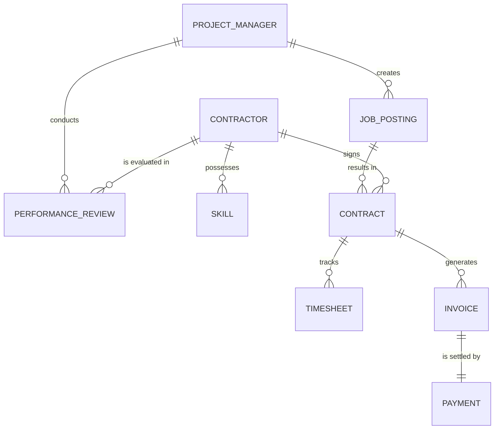

# Conceptual ERD — Contractor and Freelancer Management System

## Mermaid Code

## Entity Description Table | Bang mo ta Entity

| # | Entity Name | Vietnamese Name | Description | Key Attributes | Main Relationships |
|---|-------------|-----------------|-------------|----------------|-------------------|
| 1 | PROJECT_MANAGER | Quan ly du an | Nguoi dang tuyen dung va quan ly du an | manager_id, name, department | creates JOB_POSTING, conducts PERFORMANCE_REVIEW |
| 2 | CONTRACTOR | Nguoi lao dong tu do | Ho so ca nhan cua freelancer | contractor_id, name, email | signs CONTRACT, possesses SKILL |
| 3 | SKILL | Ky nang | Danh sach ky nang cua contractor | skill_id, skill_name, proficiency | belongs to CONTRACTOR |
| 4 | JOB_POSTING | Bai dang cong viec | Yeu cau cong viec duoc dang tuyen | job_id, title, budget | results in CONTRACT |
| 5 | CONTRACT | Hop dong | Thoa thuan cong viec giua hai ben | contract_id, start_date, end_date | tracks TIMESHEET, generates INVOICE |
| 6 | TIMESHEET | Bang cham cong | Ghi nhan thoi gian lam viec | timesheet_id, hours_worked, date | belongs to CONTRACT |
| 7 | INVOICE | Hoa don | Yeu cau thanh toan cua contractor | invoice_id, amount, status | is settled by PAYMENT |
| 8 | PAYMENT | Giao dich thanh toan | Thong tin giai ngan | payment_id, date, method | settles INVOICE |
| 9 | PERFORMANCE_REVIEW | Danh gia nang luc | Phieu danh gia chat luong cong viec | review_id, score, comments | belongs to CONTRACTOR |

## Relationship Description | Mo ta Quan he

| # | From Entity | Cardinality | To Entity | Relationship Label | Business Explanation |
|---|-------------|-------------|-----------|-------------------|----------------------|
| 1 | PROJECT_MANAGER | one-to-many | JOB_POSTING | creates | Mot nguoi quan ly du an co the tao nhieu bai dang cong viec. |
| 2 | PROJECT_MANAGER | one-to-many | PERFORMANCE_REVIEW| conducts | Mot nguoi quan ly du an thuc hien nhieu ban danh gia. |
| 3 | CONTRACTOR | one-to-many | SKILL | possesses | Mot freelancer co the co nhieu ky nang khac nhau. |
| 4 | JOB_POSTING | one-to-many | CONTRACT | results in | Mot bai dang co the dan den viec ky nhieu hop dong. |
| 5 | CONTRACTOR | one-to-many | CONTRACT | signs | Mot freelancer co the ky nhieu hop dong cho cac du an khac nhau. |
| 6 | CONTRACT | one-to-many | TIMESHEET | tracks | Mot hop dong co the co nhieu ban ghi thoi gian lam viec. |
| 7 | CONTRACT | one-to-many | INVOICE | generates | Mot hop dong co the sinh ra nhieu hoa don thanh toan. |
| 8 | INVOICE | one-to-one | PAYMENT | is settled by | Moi hoa don duoc thanh toan boi mot giao dich cu the. |
| 9 | CONTRACTOR | one-to-many | PERFORMANCE_REVIEW| is evaluated in | Mot freelancer nhan duoc nhieu danh gia tu cac du an da lam. |
