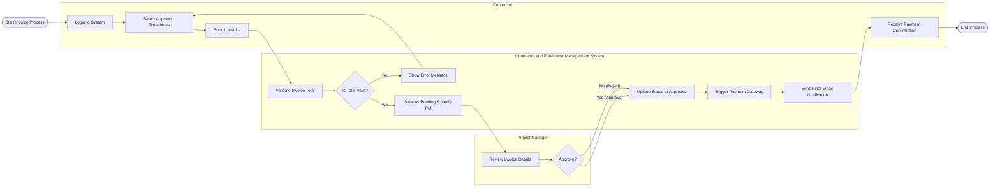

# Swimlane Diagram — Contractor and Freelancer Management System

## Mermaid Code

## Flow Description | Mo ta luong

| Lane | Actor | Role in Flow |
|------|-------|-------------|
| 1 | Contractor | Nguoi chu dong tao va nop hoa don dua tren bang cham cong da duyet, va nhan thong bao ket qua. |
| 2 | Contractor and Freelancer Management System | He thong kiem tra tinh hop le cua hoa don, quan ly trang thai, va goi cong thanh toan neu duoc duyet. |
| 3 | Project Manager | Nguoi quan ly nhan duoc thong bao, vao he thong de xem xet chi tiet va phe duyet/tu choi hoa don. |
