# Action Tree — Contractor and Freelancer Management System

## Mermaid Code

```mermaid
%%{init: {'theme': 'default'}}%%
graph TD
    Root["Contractor and Freelancer Management System"]

    Root --> M1["Profile & Identity Management"]
    Root --> M2["Job & Contract Management"]
    Root --> M3["Time & Invoice Management"]
    Root --> M4["Payment & Tax Management"]
    Root --> M5["Performance Management"]

    M1 --> A11["Update Skills & Portfolio"]
    M1 --> A12["Verify Identity Documents"]
    M1 --> A13["Manage User Roles"]

    M2 --> A21["Post New Job"]
    M2 --> A22["Review Applications"]
    M2 --> A23["Draft & Sign Contracts"]
    M2 --> A24["Terminate Contracts"]

    M3 --> A31["Submit Weekly Timesheet"]
    M3 --> A32["Approve Timesheets"]
    M3 --> A33["Generate Invoice"]
    M3 --> A34["Approve Invoices"]

    M4 --> A41["Process Bank Disbursements"]
    M4 --> A42["Track Payment Status"]
    M4 --> A43["Generate Tax Reports"]

    M5 --> A51["Conduct Project Review"]
    M5 --> A52["Rate Contractor Work"]
    M5 --> A53["View Feedback History"]
```

## Module Description | Mo ta Module

| # | Module | Description | Actions |
|---|--------|-------------|---------|
| 1 | Profile & Identity Management | Quan ly ho so nang luc va xac thuc danh tinh | Update Skills & Portfolio, Verify Identity Documents, Manage User Roles |
| 2 | Job & Contract Management | Quan ly qua trinh tuyen dung va thoa thuan hop dong | Post New Job, Review Applications, Draft & Sign Contracts, Terminate Contracts |
| 3 | Time & Invoice Management | Quan ly thoi gian lam viec va qua trinh yeu cau thanh toan | Submit Weekly Timesheet, Approve Timesheets, Generate Invoice, Approve Invoices |
| 4 | Payment & Tax Management | Quan ly dong tien ra va bao cao kiem soat thue | Process Bank Disbursements, Track Payment Status, Generate Tax Reports |
| 5 | Performance Management | Quan ly danh gia ket qua sau khi hoan thanh du an | Conduct Project Review, Rate Contractor Work, View Feedback History |
