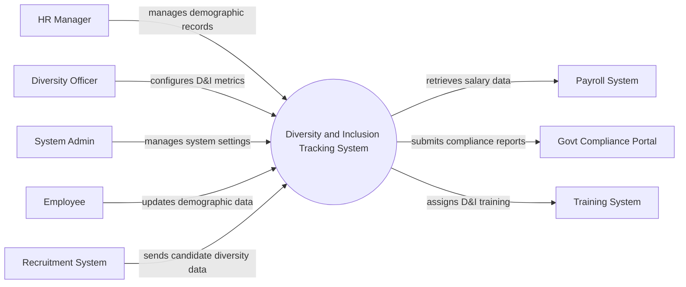

# Context Diagram — Diversity and Inclusion Tracking System

## Mermaid Code

## Actor & Interaction Table | Bang Actor & Tuong tac

| # | Actor | Actor Type | Data Sent TO System | Data Received FROM System | Notes |
|---|-------|------------|---------------------|---------------------------|-------|
| 1 | HR Manager | Primary | Demographic updates, organizational data | Diversity reports, demographic alerts | Quan ly nhan su |
| 2 | Employee | Primary | Demographic profile, incident reports, ERG requests | Notifications, training assignments | Nhan vien trong cong ty |
| 3 | Diversity Officer | Primary | D&I metrics configuration, goal settings | Analytic dashboards, incident summaries | Chuyen vien da dang va hoa nhap |
| 4 | System Admin | Primary | User roles, system configurations, permissions | System logs, audit reports | Quan tri he thong |
| 5 | Recruitment System | Supporting | Candidate demographic data | Recruitment diversity goals | He thong tuyen dung |
| 6 | Payroll System | Supporting | Salary data request | Pay equity analysis results | He thong tinh luong |
| 7 | Govt Compliance Portal | Regulatory | Regulatory policy updates | D&I compliance reports | Cong thong tin Chinh phu |
| 8 | Training System | Supporting | Training completion statuses | D&I training assignments | He thong dao tao |

## System Boundary Description | Mo ta Pham vi He thong

The Diversity and Inclusion Tracking System (DITS) is responsible for managing and analyzing demographic data, pay equity, and workplace inclusion metrics. It serves as the central hub for Diversity Officers, HR Managers, and Employees to interact regarding diversity goals, employee resource groups (ERGs), and incident reporting. The system does not directly run payroll or execute candidate recruitment; instead, it integrates with external Payroll Systems and Recruitment Systems to fetch relevant data. Additionally, it automates the submission of regulatory data to the Govt Compliance Portal.
