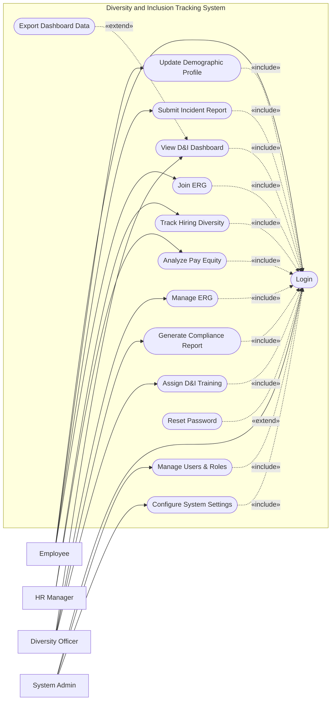

# Use Case Diagram — Diversity and Inclusion Tracking System

## Mermaid Code

## Actor Table | Bang Actor

| # | Actor | Actor Type | Role Description | Related Use Cases |
|---|-------|------------|------------------|-------------------|
| 1 | Employee | Primary | Nhan vien cung cap du lieu nhan khau hoc va tham gia ERG | UC01, UC02, UC03, UC08 |
| 2 | HR Manager | Primary | Nhan su quan ly du lieu tuyen dung va tra luong | UC05, UC06 |
| 3 | Diversity Officer | Primary | Chuyen vien chiu trach nhiem chinh ve cac muc tieu D&I | UC04, UC07, UC09, UC14 |
| 4 | System Admin | Primary | Quan tri vien he thong, phan quyen va cai dat | UC01, UC10, UC11 |

## Use Case Table | Bang Use Case

| # | UC ID | Use Case Name | Primary Actor | Secondary Actor | Description | Priority |
|---|-------|---------------|---------------|-----------------|-------------|----------|
| 1 | UC01 | Login | Employee | | Authenticate user access | High |
| 2 | UC02 | Update Demographic Profile | Employee | | Update voluntary demographic information | High |
| 3 | UC03 | Submit Incident Report | Employee | | Report workplace inclusion incidents | High |
| 4 | UC04 | View D&I Dashboard | Diversity Officer | | View real-time diversity metrics | High |
| 5 | UC05 | Track Hiring Diversity | HR Manager | Recruitment System | Monitor demographic of candidates | Medium |
| 6 | UC06 | Analyze Pay Equity | HR Manager | Payroll System | Compare compensation across demographics | High |
| 7 | UC07 | Manage ERG | Diversity Officer | | Create and administer Employee Resource Groups | Medium |
| 8 | UC08 | Join ERG | Employee | | Enroll in an Employee Resource Group | Low |
| 9 | UC09 | Generate Compliance Report | Diversity Officer | Govt Compliance Portal| Create mandatory regulatory reports | High |
| 10| UC10 | Manage Users & Roles | System Admin | | Manage access control and user profiles | High |
| 11| UC11 | Configure System Settings | System Admin | | Update system parameters | Medium |
| 12| UC12 | Reset Password | Employee | | Recover forgotten passwords | High |
| 13| UC13 | Export Dashboard Data | Diversity Officer | | Export analytics to external formats | Low |
| 14| UC14 | Assign D&I Training | Diversity Officer | Training System | Recommend diversity training to staff | Medium |

## Use Case Specification | Dac ta Use Case

---

### UC01 — Login

| Field | Detail |
|-------|--------|
| **UC ID** | UC01 |
| **Use Case Name** | Login |
| **Actor(s)** | Primary: Employee, HR Manager, Diversity Officer, System Admin |
| **Description** | Cho phep nguoi dung xac thuc de dang nhap vao he thong an toan. |
| **Precondition** | 1. Nguoi dung phai co tai khoan hop le.  2. He thong dang hoat dong. |
| **Main Flow** | 1. Actor mo trang dang nhap.  2. System hien thi form dang nhap.  3. Actor nhap username va password.  4. Actor nhan Submit.  5. System xac thuc thong tin.  6. System chuyen huong den trang chu theo quyen han. |
| **Alternative Flow** | **AF1** — Quen mat khau: Neu Actor chon "Forgot Password", System kich hoat UC12 Reset Password. |
| **Exception Flow** | **EX1** — Sai thong tin: Neu xac thuc that bai, System hien thi thong bao loi va yeu cau nhap lai.  **EX2** — Tai khoan khoa: Neu sai qua 5 lan, System khoa tai khoan va thong bao lien he Admin. |
| **Postcondition** | Nguoi dung dang nhap thanh cong, phien lam viec (session) duoc tao. |
| **Business Rule** | **BR1**: Mat khau phai duoc ma hoa an toan.  **BR2**: Phien dang nhap tu dong het han sau 30 phut khong hoat dong. |

---

### UC02 — Update Demographic Profile

| Field | Detail |
|-------|--------|
| **UC ID** | UC02 |
| **Use Case Name** | Update Demographic Profile |
| **Actor(s)** | Primary: Employee |
| **Description** | Nhan vien cap nhat thong tin nhan khau hoc tu nguyen (gioi tinh, chung toc, khuyet tat). |
| **Precondition** | 1. Nhan vien da dang nhap (Include UC01). |
| **Main Flow** | 1. Actor chon "My Profile".  2. System hien thi form thong tin nhan khau hoc hien tai.  3. Actor thay doi cac truong thong tin (hoac chon "Prefer not to say").  4. Actor nhan "Save".  5. System kiem tra tinh hop le.  6. System luu du lieu va hien thi thong bao thanh cong. |
| **Alternative Flow** | **AF1** — Huy bo: Truoc khi luu, Actor chon "Cancel", System quay lai trang chu ma khong luu. |
| **Exception Flow** | **EX1** — Loi ket noi: Neu he thong khong the luu do mang loi, System hien thi thong bao thu lai sau. |
| **Postcondition** | Du lieu nhan khau hoc duoc cap nhat. |
| **Business Rule** | **BR1**: Thong tin nay la tu nguyen, luon co tuy chon "Prefer not to say".  **BR2**: Du lieu chi duoc dung de tong hop, an danh danh tinh trong cac bao cao. |

---

### UC04 — View D&I Dashboard

| Field | Detail |
|-------|--------|
| **UC ID** | UC04 |
| **Use Case Name** | View D&I Dashboard |
| **Actor(s)** | Primary: Diversity Officer |
| **Description** | Cho phep quan ly xem cac bieu do truc quan ve tinh hinh da dang va hoa nhap cua to chuc. |
| **Precondition** | 1. Diversity Officer da dang nhap (Include UC01). |
| **Main Flow** | 1. Actor chon menu "D&I Dashboard".  2. System truy xuat du lieu tu cac phan he (Demographic, Hiring, Incident).  3. System hien thi cac bieu do, chi so va muc tieu.  4. Actor chon bo loc (theo phong ban, thoi gian).  5. System cap nhat bieu do theo bo loc.  6. Actor xem bieu do. |
| **Alternative Flow** | **AF1** — Xuat file: Tu Dashboard, Actor co the kich hoat UC13 Export Dashboard Data. |
| **Exception Flow** | **EX1** — Khong co du lieu: Neu phong ban chua co du lieu, System hien thi thong bao "No data available". |
| **Postcondition** | Thong tin duoc hien thi cho nguoi dung xem xet. |
| **Business Rule** | **BR1**: Du lieu hien thi phai duoc cap nhat real-time hoac cham nhat 1 gio.  **BR2**: Cac nhom duoi 5 nguoi khong duoc hien thi de bao mat danh tinh (an danh hoa). |

---

### UC06 — Analyze Pay Equity

| Field | Detail |
|-------|--------|
| **UC ID** | UC06 |
| **Use Case Name** | Analyze Pay Equity |
| **Actor(s)** | Primary: HR Manager |
| **Description** | Phan tich su cong bang trong tra luong giua cac nhom nhan khau hoc de phat hien chenh lech. |
| **Precondition** | 1. HR Manager da dang nhap (Include UC01).  2. Du lieu tu Payroll System da duoc dong bo. |
| **Main Flow** | 1. Actor mo chuc nang "Pay Equity Analysis".  2. System hien thi giao dien thiet lap phan tich.  3. Actor chon tieu chi (gioi tinh, chung toc, vi tri cong viec, tham nien).  4. Actor nhan "Analyze".  5. System so sanh muc luong trung binh, trung vi theo tieu chi da chon.  6. System hien thi bao cao chi tiet ve su chenh lech luong. |
| **Alternative Flow** | **AF1** — Luu bao cao: Sau khi phan tich, Actor nhan "Save Report" de xem lai sau. |
| **Exception Flow** | **EX1** — Loi dong bo luong: Neu du lieu luong khong kha dung, System bao loi va yeu cau kiem tra API toi Payroll System. |
| **Postcondition** | Bao cao phan tich chenh lech luong duoc sinh ra va hien thi. |
| **Business Rule** | **BR1**: Viec so sanh phai tinh den vi tri va tham nien de tranh ket luan sai lech.  **BR2**: Chi HR Manager moi duoc phep truy cap du lieu luong ket hop nhan khau hoc. |
