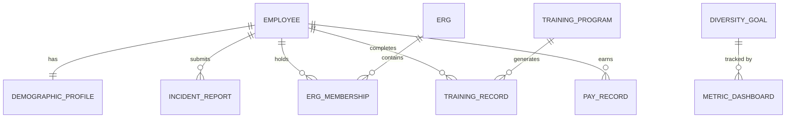

# Conceptual ERD — Diversity and Inclusion Tracking System

## Mermaid Code

## Entity Description Table | Bang mo ta Entity

| # | Entity Name | Vietnamese Name | Description | Key Attributes | Main Relationships |
|---|-------------|-----------------|-------------|----------------|-------------------|
| 1 | EMPLOYEE | Nhan vien | Thong tin nhan su co ban | employee_id, name, department | has DEMOGRAPHIC_PROFILE |
| 2 | DEMOGRAPHIC_PROFILE | Ho so nhan khau hoc | Du lieu tu nguyen ve gioi tinh, chung toc | profile_id, gender, ethnicity | belongs to EMPLOYEE |
| 3 | INCIDENT_REPORT | Bao cao su co | Ghi nhan cac van de ve thieu hoa nhap, phan biet | report_id, description, status | belongs to EMPLOYEE |
| 4 | ERG | Nhom tai nguyen nhan vien | Cac nhom do nhan vien lap ra ho tro D&I | erg_id, name, description | contains ERG_MEMBERSHIP |
| 5 | ERG_MEMBERSHIP | The thanh vien ERG | Su tham gia cua nhan vien vao ERG | membership_id, join_date | belongs to EMPLOYEE, ERG |
| 6 | TRAINING_PROGRAM | Chuong trinh dao tao | Cac khoa hoc ve da dang va hoa nhap | program_id, title, duration | generates TRAINING_RECORD |
| 7 | TRAINING_RECORD | Ban ghi dao tao | Ket qua hoan thanh dao tao cua nhan vien | record_id, status, completion_date | belongs to EMPLOYEE, TRAINING_PROGRAM |
| 8 | PAY_RECORD | Ban ghi luong | Du lieu muc luong duoc dong bo tu he thong khac | pay_id, amount, currency | belongs to EMPLOYEE |
| 9 | DIVERSITY_GOAL | Muc tieu da dang | Cac chi tieu D&I do to chuc de ra | goal_id, metric_type, target_value | tracked by METRIC_DASHBOARD |
| 10| METRIC_DASHBOARD | Bang dieu khien chi so | Tap hop cac so lieu de phan tich | dashboard_id, current_value | tracks DIVERSITY_GOAL |

## Relationship Description | Mo ta Quan he

| # | From Entity | Cardinality | To Entity | Relationship Label | Business Explanation |
|---|-------------|-------------|-----------|-------------------|----------------------|
| 1 | EMPLOYEE | one-to-one | DEMOGRAPHIC_PROFILE | has | Moi nhan vien co mot ho so nhan khau hoc duy nhat. |
| 2 | EMPLOYEE | one-to-many | INCIDENT_REPORT | submits | Mot nhan vien co the bao cao nhieu su co khac nhau. |
| 3 | EMPLOYEE | one-to-many | ERG_MEMBERSHIP | holds | Mot nhan vien co the la thanh vien cua nhieu ERG. |
| 4 | EMPLOYEE | one-to-many | TRAINING_RECORD | completes | Mot nhan vien co the hoan thanh nhieu khoa dao tao. |
| 5 | EMPLOYEE | one-to-many | PAY_RECORD | earns | Mot nhan vien co nhieu ban ghi nhan luong trong qua khu. |
| 6 | ERG | one-to-many | ERG_MEMBERSHIP | contains | Mot nhom ERG bao gom nhieu the thanh vien. |
| 7 | TRAINING_PROGRAM | one-to-many | TRAINING_RECORD | generates | Mot khoa dao tao co the tao ra nhieu ban ghi hoan thanh cua cac nhan vien khac nhau. |
| 8 | DIVERSITY_GOAL | one-to-many | METRIC_DASHBOARD | tracked by | Mot muc tieu D&I duoc theo doi tren nhieu bieu do/chi so tren bang dieu khien. |
