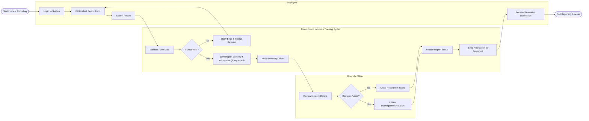

# Swimlane Diagram — Diversity and Inclusion Tracking System

## Mermaid Code

## Flow Description | Mo ta luong

| Lane | Actor | Role in Flow |
|------|-------|-------------|
| 1 | Employee | Nguoi chu dong bao cao mot su co lien quan toi van de thieu hoa nhap, phan biet hoac bat cong. |
| 2 | Diversity and Inclusion Tracking System | He thong kiem tra tinh hop le, bao mat du lieu (co the an danh hoa), luu tru va tu dong thong bao cac ben. |
| 3 | Diversity Officer | Chuyen vien chiu trach nhiem xem xet bao cao, quyet dinh co can tien hanh dieu tra hoac hoa giai khong, va dong bao cao sau khi xu ly. |
