# Action Tree — Diversity and Inclusion Tracking System

## Mermaid Code

```mermaid
%%{init: {'theme': 'default'}}%%
graph TD
    Root["Diversity and Inclusion Tracking System"]

    Root --> M1["Demographic Management"]
    Root --> M2["Incident Tracking"]
    Root --> M3["Pay Equity & Analytics"]
    Root --> M4["ERG Management"]
    Root --> M5["Compliance & Training"]

    M1 --> A11["Update Demographic Profile"]
    M1 --> A12["Manage Data Anonymity"]
    M1 --> A13["Track Hiring Diversity Metrics"]

    M2 --> A21["Submit Incident Report"]
    M2 --> A22["Review Incident Status"]
    M2 --> A23["Conduct Case Mediation"]
    M2 --> A24["Close Incident Case"]

    M3 --> A31["Configure D&I Dashboard"]
    M3 --> A32["Analyze Pay Equity"]
    M3 --> A33["Generate Diversity Heatmap"]
    M3 --> A34["Export Analytics Data"]

    M4 --> A41["Create New ERG"]
    M4 --> A42["Approve ERG Charter"]
    M4 --> A43["Manage ERG Membership"]
    M4 --> A44["Allocate ERG Budget"]

    M5 --> A51["Generate Regulatory Report"]
    M5 --> A52["Assign D&I Training"]
    M5 --> A53["Track Training Completion"]
```

## Module Description | Mo ta Module

| # | Module | Description | Actions |
|---|--------|-------------|---------|
| 1 | Demographic Management | Quan ly thong tin nhan khau hoc tu nguyen cua nhan vien va ung vien | Update Demographic Profile, Manage Data Anonymity, Track Hiring Diversity Metrics |
| 2 | Incident Tracking | Ghi nhan, theo doi va xu ly cac su co lien quan den thieu hoa nhap/phan biet | Submit Incident Report, Review Incident Status, Conduct Case Mediation, Close Incident Case |
| 3 | Pay Equity & Analytics | Phan tich cong bang trong tra luong va truc quan hoa cac chi so D&I | Configure D&I Dashboard, Analyze Pay Equity, Generate Diversity Heatmap, Export Analytics Data |
| 4 | ERG Management | Ho tro va quan ly cac Nhom Tai nguyen Nhan vien (Employee Resource Groups) | Create New ERG, Approve ERG Charter, Manage ERG Membership, Allocate ERG Budget |
| 5 | Compliance & Training | Dam bao tuan thu quy dinh nha nuoc va to chuc cac khoa dao tao D&I | Generate Regulatory Report, Assign D&I Training, Track Training Completion |
