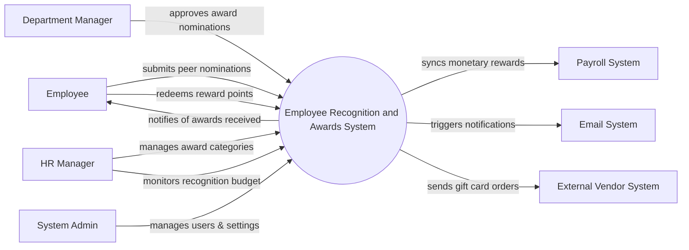

# Context Diagram — Employee Recognition and Awards System

## Mermaid Code

## Actor & Interaction Table | Bang Actor & Tuong tac

| # | Actor | Actor Type | Data Sent TO System | Data Received FROM System | Notes |
|---|-------|------------|---------------------|---------------------------|-------|
| 1 | Employee | Primary | Peer nominations, point redemption requests | Award notifications, reward catalog, point balance | Nhan vien tham gia chuong trinh |
| 2 | Department Manager | Primary | Nomination approvals/rejections | Pending nominations, team recognition reports | Quan ly xet duyet |
| 3 | HR Manager | Primary | Award category configurations, budget limits | System usage reports, budget consumption data | Quan ly chuong trinh HR |
| 4 | System Admin | Primary | User roles, system configurations | System logs, audit reports | Quan tri he thong |
| 5 | Payroll System | Supporting | Payroll sync confirmation | Approved monetary rewards | He thong luong |
| 6 | Email System | Supporting | Email delivery status | Award certificates, system notifications | He thong gui email |
| 7 | External Vendor System | Supporting | Gift card codes, fulfillment status | Redemption orders | He thong doi thuong ngoai |

## System Boundary Description | Mo ta Pham vi He thong

The Employee Recognition and Awards System manages peer-to-peer nominations, manager awards, and point redemptions to foster a positive workplace culture. It handles the workflow from submitting a nomination to approval and reward point allocation. The system does not natively handle payroll processing or physical item delivery; it integrates with the Payroll System for monetary rewards and External Vendor Systems for gift card fulfillments.
