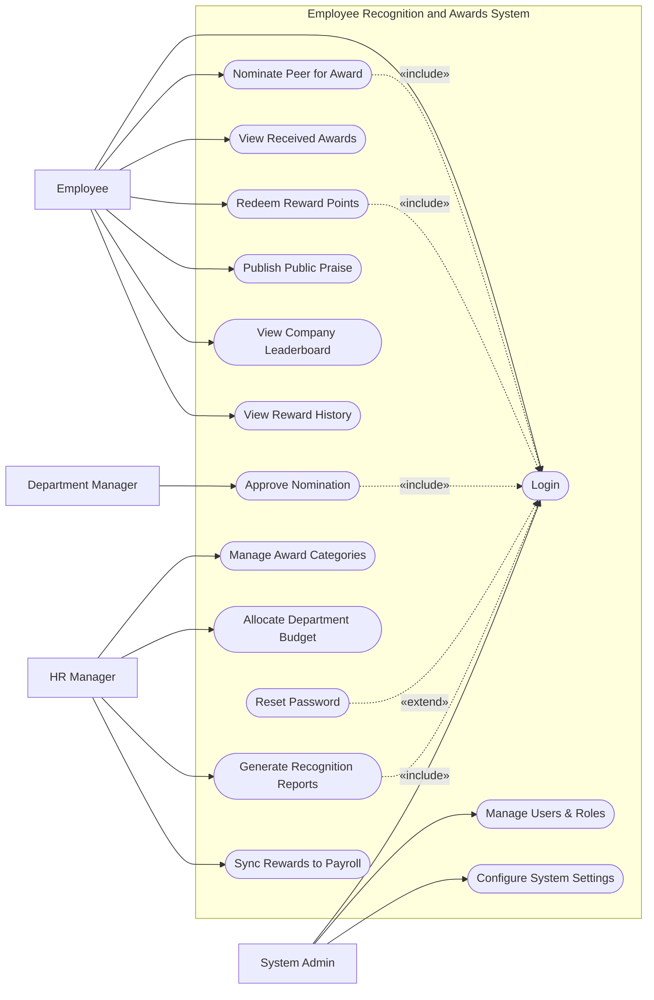

# Use Case Diagram — Employee Recognition and Awards System

## Mermaid Code

## Actor Table | Bang Actor

| # | Actor | Actor Type | Role Description | Related Use Cases |
|---|-------|------------|------------------|-------------------|
| 1 | Employee | Primary | Nhan vien thong thuong trong cong ty | UC01, UC02, UC03, UC04, UC09, UC10, UC15 |
| 2 | Department Manager | Primary | Nguoi quan ly xet duyet de cu cua phong ban | UC05 |
| 3 | HR Manager | Primary | Nguoi quan ly chuong trinh va ngan sach | UC06, UC07, UC08, UC11 |
| 4 | System Admin | Primary | Quan tri vien he thong | UC01, UC12, UC13 |

## Use Case Table | Bang Use Case

| # | UC ID | Use Case Name | Primary Actor | Secondary Actor | Description | Priority |
|---|-------|---------------|---------------|-----------------|-------------|----------|
| 1 | UC01 | Login | Employee | | Authenticate user access | High |
| 2 | UC02 | Nominate Peer for Award | Employee | | Submit a colleague for an award | High |
| 3 | UC03 | View Received Awards | Employee | | View past recognitions received | Medium |
| 4 | UC04 | Redeem Reward Points | Employee | External Vendor | Exchange points for gifts/vouchers | High |
| 5 | UC05 | Approve Nomination | Department Manager | | Review and approve employee nominations | High |
| 6 | UC06 | Manage Award Categories | HR Manager | | Create and configure award types | High |
| 7 | UC07 | Allocate Department Budget| HR Manager | | Set point budget limits per department | Medium |
| 8 | UC08 | Generate Recognition Reports| HR Manager | | View usage and participation stats | Medium |
| 9 | UC09 | Publish Public Praise | Employee | | Share recognition on the company feed | Low |
| 10| UC10 | View Company Leaderboard | Employee | | View top recognized employees | Low |
| 11| UC11 | Sync Rewards to Payroll | HR Manager | Payroll System | Transfer monetary bonuses to payroll | High |
| 12| UC12 | Manage Users & Roles | System Admin | | Manage system access and permissions | High |
| 13| UC13 | Configure System Settings | System Admin | | Configure system-wide variables | Medium |
| 14| UC14 | Reset Password | Employee | | Recover user account access | High |
| 15| UC15 | View Reward History | Employee | | Track point earning and spending | Medium |

## Use Case Specification | Dac ta Use Case

---

### UC01 — Login

| Field | Detail |
|-------|--------|
| **UC ID** | UC01 |
| **Use Case Name** | Login |
| **Actor(s)** | Primary: Employee, Department Manager, HR Manager, System Admin |
| **Description** | Cho phep nguoi dung xac thuc de dang nhap vao he thong. |
| **Precondition** | 1. Nguoi dung phai co tai khoan hop le.  2. He thong dang hoat dong. |
| **Main Flow** | 1. Actor mo trang dang nhap.  2. System hien thi form dang nhap.  3. Actor nhap username va password.  4. Actor nhan Submit.  5. System xac thuc thong tin.  6. System chuyen huong den trang chu. |
| **Alternative Flow** | **AF1** — Quen mat khau: Actor chon "Forgot Password", System kich hoat UC14 Reset Password. |
| **Exception Flow** | **EX1** — Sai thong tin: System bao loi va yeu cau nhap lai.  **EX2** — Tai khoan khoa: Nhap sai qua 5 lan, System khoa tam thoi. |
| **Postcondition** | Nguoi dung duoc cap phien dang nhap hop le. |
| **Business Rule** | **BR1**: Mat khau phai duoc ma hoa.  **BR2**: Tu dong dang xuat sau 30 phut khong hoat dong. |

---

### UC02 — Nominate Peer for Award

| Field | Detail |
|-------|--------|
| **UC ID** | UC02 |
| **Use Case Name** | Nominate Peer for Award |
| **Actor(s)** | Primary: Employee |
| **Description** | Nhan vien tao de cu khen thuong cho dong nghiep cung cong ty. |
| **Precondition** | 1. Nhan vien da dang nhap (Include UC01).  2. Chuong trinh khen thuong dang mo. |
| **Main Flow** | 1. Actor chon "Nominate Peer".  2. System hien thi danh sach cac loai giai thuong.  3. Actor chon loai giai thuong va chon dong nghiep muon de cu.  4. Actor nhap ly do de cu.  5. Actor nhan Submit.  6. System luu de cu va gui thong bao cho Manager cua nguoi duoc de cu. |
| **Alternative Flow** | **AF1** — Luu nhap: Actor chon "Save Draft" de tiep tuc sau. |
| **Exception Flow** | **EX1** — Tu de cu: Neu chon chinh minh, System bao loi "Cannot nominate yourself". |
| **Postcondition** | De cu duoc luu o trang thai "Pending Approval". |
| **Business Rule** | **BR1**: Khong the tu de cu chinh minh.  **BR2**: So luong de cu moi thang co the bi gioi han. |

---

### UC04 — Redeem Reward Points

| Field | Detail |
|-------|--------|
| **UC ID** | UC04 |
| **Use Case Name** | Redeem Reward Points |
| **Actor(s)** | Primary: Employee, Secondary: External Vendor |
| **Description** | Nhan vien su dung diem thuong de doi lay qua tang hoac voucher. |
| **Precondition** | 1. Nhan vien dang nhap (Include UC01).  2. Nhan vien co du diem trong tai khoan. |
| **Main Flow** | 1. Actor truy cap "Rewards Catalog".  2. System hien thi danh muc qua tang.  3. Actor chon mon qua va nhan "Redeem".  4. System kiem tra so du diem.  5. System tao don doi qua va tru diem tong.  6. System gui yeu cau cho External Vendor xu ly. |
| **Alternative Flow** | **AF1** — Huy truoc khi doi: Actor huy o man hinh xac nhan, he thong khong tru diem. |
| **Exception Flow** | **EX1** — Khong du diem: System bao loi "Insufficient points".  **EX2** — Qua tang het han/het hang: System bao loi "Item out of stock". |
| **Postcondition** | Don hang doi qua duoc tao, diem bi tru va Vendor nhan yeu cau. |
| **Business Rule** | **BR1**: Diem khong the quy doi thanh tien mat (tru khi quy dinh khac).  **BR2**: Mon qua da doi khong the hoan tra. |

---

### UC05 — Approve Nomination

| Field | Detail |
|-------|--------|
| **UC ID** | UC05 |
| **Use Case Name** | Approve Nomination |
| **Actor(s)** | Primary: Department Manager |
| **Description** | Manager xem xet va phe duyet cac de cu khen thuong cua nhan vien trong phong. |
| **Precondition** | 1. Manager da dang nhap (Include UC01).  2. Co de cu o trang thai "Pending". |
| **Main Flow** | 1. Actor vao "Nomination Approvals".  2. System hien thi danh sach de cu dang cho.  3. Actor xem chi tiet mot de cu.  4. Actor nhan "Approve" (Phe duyet).  5. System cap nhat trang thai, cong diem thuong cho nguoi nhan va gui thong bao. |
| **Alternative Flow** | **AF1** — Tu choi: Actor nhan "Reject" va ghi chu ly do. System cap nhat trang thai va gui thong bao cho nguoi de cu. |
| **Exception Flow** | **EX1** — De cu da xu ly: He thong bao loi neu de cu da bi huy hoac duyet truoc do. |
| **Postcondition** | De cu duoc cap nhat trang thai va diem thuong (neu co) duoc phan bo. |
| **Business Rule** | **BR1**: Chi quan ly truc tiep moi duoc duyet de cu.  **BR2**: Neu phong ban het ngan sach diem, khong the duyet de cu co kem diem thuong. |

---

### UC08 — Generate Recognition Reports

| Field | Detail |
|-------|--------|
| **UC ID** | UC08 |
| **Use Case Name** | Generate Recognition Reports |
| **Actor(s)** | Primary: HR Manager |
| **Description** | HR xuat bao cao thong ke viec su dung ngan sach va hoat dong khen thuong. |
| **Precondition** | 1. HR Manager da dang nhap (Include UC01). |
| **Main Flow** | 1. Actor chon "Reports".  2. System hien thi cac loai bao cao (Ngan sach, Nhan vien tieu bieu...).  3. Actor chon bo loc (Thoi gian, Phong ban).  4. Actor nhan "Generate".  5. System tong hop du lieu va hien thi bieu do/bang bieu.  6. Actor chon "Export to Excel/PDF". |
| **Alternative Flow** | **AF1** — Khong co du lieu: System hien thi "No data available for selected period". |
| **Exception Flow** | **EX1** — Loi he thong xuat file: System bao "Export failed, please try again". |
| **Postcondition** | File bao cao duoc tao va tai xuong thanh cong. |
| **Business Rule** | **BR1**: HR Manager duoc xem du lieu cua toan bo cong ty.  **BR2**: Du lieu xuat ra phai phu hop voi quyen han cua nguoi dung. |
