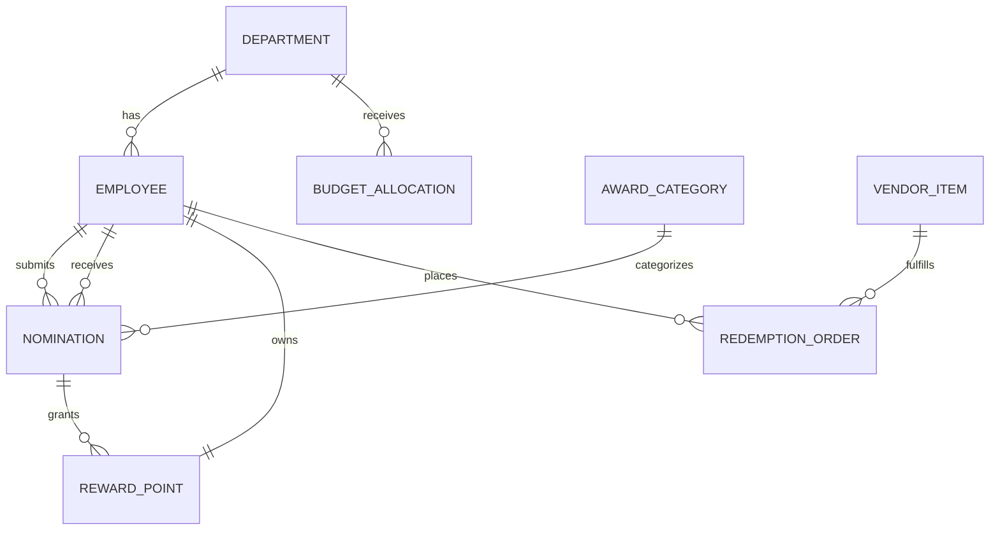

# Conceptual ERD — Employee Recognition and Awards System

## Mermaid Code

## Entity Description Table | Bang mo ta Entity

| # | Entity Name | Vietnamese Name | Description | Key Attributes | Main Relationships |
|---|-------------|-----------------|-------------|----------------|-------------------|
| 1 | DEPARTMENT | Phong ban | Phong ban trong cong ty | department_id, name | has EMPLOYEE |
| 2 | EMPLOYEE | Nhan vien | Nguoi dung trong he thong | employee_id, name, email | submits NOMINATION |
| 3 | BUDGET_ALLOCATION | Ngan sach | Ngan sach diem cua tung phong ban | budget_id, total_points, period | belongs to DEPARTMENT |
| 4 | AWARD_CATEGORY | Loai giai thuong | Danh muc cac giai thuong he thong | category_id, name, base_points | categorizes NOMINATION |
| 5 | NOMINATION | De cu | Phieu de cu khen thuong | nomination_id, reason, status | belongs to EMPLOYEE |
| 6 | REWARD_POINT | Diem thuong | Tong so diem hien co cua nhan vien | point_id, balance | owns by EMPLOYEE |
| 7 | REDEMPTION_ORDER | Don doi qua | Phieu yeu cau doi qua bang diem | order_id, order_date, status | places by EMPLOYEE |
| 8 | VENDOR_ITEM | San pham qua tang | Danh muc qua tang tu doi tac | item_id, item_name, point_cost | fulfills REDEMPTION_ORDER |

## Relationship Description | Mo ta Quan he

| # | From Entity | Cardinality | To Entity | Relationship Label | Business Explanation |
|---|-------------|-------------|-----------|-------------------|----------------------|
| 1 | DEPARTMENT | one-to-many | EMPLOYEE | has | Mot phong ban co nhieu nhan vien. |
| 2 | DEPARTMENT | one-to-many | BUDGET_ALLOCATION | receives | Mot phong ban nhan nhieu ky ngan sach diem. |
| 3 | AWARD_CATEGORY | one-to-many | NOMINATION | categorizes | Mot loai giai thuong duoc chon trong nhieu de cu. |
| 4 | EMPLOYEE | one-to-many | NOMINATION | submits | Mot nhan vien co the tao nhieu de cu. |
| 5 | EMPLOYEE | one-to-many | NOMINATION | receives | Mot nhan vien co the duoc nhan nhieu de cu. |
| 6 | EMPLOYEE | one-to-one | REWARD_POINT | owns | Moi nhan vien so huu mot vi diem thuong. |
| 7 | NOMINATION | one-to-many | REWARD_POINT | grants | Mot de cu thanh cong se cong diem vao vi. |
| 8 | EMPLOYEE | one-to-many | REDEMPTION_ORDER | places | Mot nhan vien co the thuc hien nhieu lan doi qua. |
| 9 | VENDOR_ITEM | one-to-many | REDEMPTION_ORDER | fulfills | Mot mon qua duoc doi trong nhieu don hang. |
