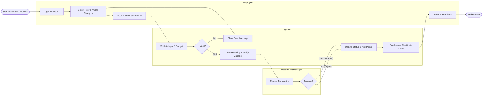

# Swimlane Diagram — Employee Recognition and Awards System

## Mermaid Code

## Flow Description | Mo ta luong

| Lane | Actor | Role in Flow |
|------|-------|-------------|
| 1 | Employee | Nguoi khoi tao yeu cau de cu dong nghiep, nhap ly do va chon loai giai thuong phu hop. |
| 2 | System | He thong kiem tra ngan sach, cap nhat trang thai don, cong diem vao vi nguoi nhan va phat hanh the ghi nhan (email). |
| 3 | Department Manager | Nguoi quan ly nhan thong bao va xet duyet tinh xung dang cua phieu de cu. |
