# Action Tree — Employee Recognition and Awards System

## Mermaid Code

```mermaid
%%{init: {'theme': 'default'}}%%
graph TD
    Root["Employee Recognition and Awards System"]

    Root --> M1["Nomination & Recognition"]
    Root --> M2["Rewards & Redemption"]
    Root --> M3["Budget Management"]
    Root --> M4["Analytics & Reporting"]
    Root --> M5["System Administration"]

    M1 --> A11["Nominate Peer"]
    M1 --> A12["Approve Nomination"]
    M1 --> A13["View Recognition Feed"]
    M1 --> A14["Check Leaderboard"]

    M2 --> A21["Browse Reward Catalog"]
    M2 --> A22["Redeem Reward Points"]
    M2 --> A23["Track Order Status"]
    M2 --> A24["View Point History"]

    M3 --> A31["Set Department Budgets"]
    M3 --> A32["Monitor Budget Usage"]
    M3 --> A33["Reallocate Points"]

    M4 --> A41["View Engagement Metrics"]
    M4 --> A42["Generate Monthly Reports"]
    M4 --> A43["Export Payroll Sync Data"]

    M5 --> A51["Manage Users"]
    M5 --> A52["Configure Award Categories"]
    M5 --> A53["Update System Settings"]
```

## Module Description | Mo ta Module

| # | Module | Description | Actions |
|---|--------|-------------|---------|
| 1 | Nomination & Recognition | Quan ly viec tao, duyet va hien thi de cu khen thuong | Nominate Peer, Approve Nomination, View Recognition Feed, Check Leaderboard |
| 2 | Rewards & Redemption | Quan ly kho qua tang, diem thuong va doi qua | Browse Reward Catalog, Redeem Reward Points, Track Order Status, View Point History |
| 3 | Budget Management | Quan ly ngan sach diem cap cho cac phong ban | Set Department Budgets, Monitor Budget Usage, Reallocate Points |
| 4 | Analytics & Reporting | Thong ke du lieu khen thuong va tinh hinh tuong tac | View Engagement Metrics, Generate Monthly Reports, Export Payroll Sync Data |
| 5 | System Administration | Cai dat he thong, phan quyen va quan ly danh muc | Manage Users, Configure Award Categories, Update System Settings |
