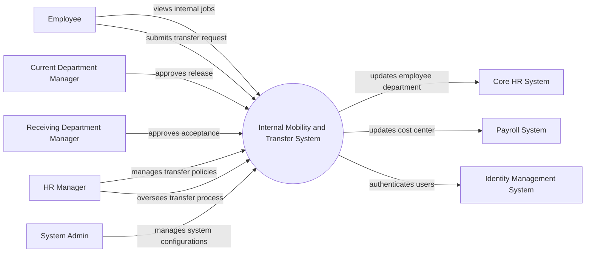

# Context Diagram — Internal Mobility and Transfer System

## Mermaid Code

## Actor & Interaction Table | Bang Actor & Tuong tac

| # | Actor | Actor Type | Data Sent TO System | Data Received FROM System | Notes |
|---|-------|------------|---------------------|---------------------------|-------|
| 1 | Employee | Primary | Transfer requests, profile updates | Internal job postings, status updates | Nhan vien co nhu cau luan chuyen |
| 2 | HR Manager | Primary | Transfer policies, manual approvals | Transfer reports, system alerts | Nhan su chuyen trach luan chuyen |
| 3 | Current Department Manager | Primary | Release approvals, feedback | Transfer notification | Quan ly phong ban hien tai |
| 4 | Receiving Department Manager | Primary | Acceptance approvals, interview results | Candidate profiles, request status | Quan ly phong ban tiep nhan |
| 5 | System Admin | Primary | System configurations, user roles | System logs, audit reports | Quan tri he thong |
| 6 | Core HR System | Supporting | Current employee data | Updated department information | He thong nhan su loi |
| 7 | Payroll System | Supporting | Cost center status | Updated cost center and salary info | He thong tinh luong |
| 8 | Identity Management System | Supporting | Authentication status | User credentials | He thong quan ly dinh danh (SSO) |

## System Boundary Description | Mo ta Pham vi He thong

The Internal Mobility and Transfer System manages the end-to-end process of employee transfers between departments. It allows employees to browse internal opportunities, apply for transfers, and tracks the multi-level approval workflow involving both current and receiving managers. The system does not directly process payroll or core HR data; instead, it integrates with the Core HR System and Payroll System to update employee records once a transfer is finalized. System Admin handles configuration and access controls.
