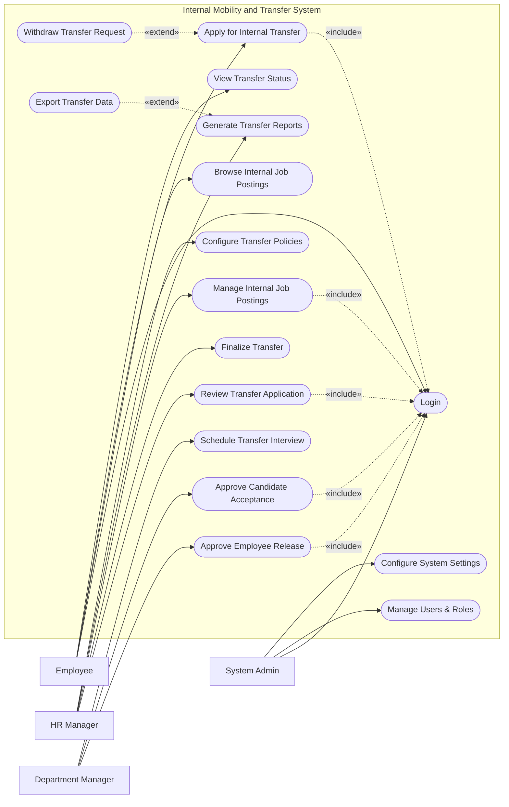

# Use Case Diagram — Internal Mobility and Transfer System

## Mermaid Code

## Actor Table | Bang Actor

| # | Actor | Actor Type | Role Description | Related Use Cases |
|---|-------|------------|------------------|-------------------|
| 1 | Employee | Primary | Nhan vien thong thuong trong cong ty muon luan chuyen | UC01, UC02, UC03, UC12 |
| 2 | Department Manager | Primary | Nguoi quan ly phong ban (hien tai hoac tiep nhan) | UC05, UC06, UC07 |
| 3 | HR Manager | Primary | Nhan su chuyen trach quan ly quy trinh luan chuyen | UC08, UC09, UC10, UC11, UC13 |
| 4 | System Admin | Primary | Quan tri vien he thong, phan quyen va cai dat | UC01, UC14, UC15 |

## Use Case Table | Bang Use Case

| # | UC ID | Use Case Name | Primary Actor | Secondary Actor | Description | Priority |
|---|-------|---------------|---------------|-----------------|-------------|----------|
| 1 | UC01 | Login | Employee | | Authenticate user access | High |
| 2 | UC02 | Browse Internal Job Postings | Employee | | View available internal opportunities | High |
| 3 | UC03 | Apply for Internal Transfer | Employee | | Submit a request to transfer | High |
| 4 | UC04 | Withdraw Transfer Request | Employee | | Cancel an ongoing transfer request | Medium |
| 5 | UC05 | Approve Employee Release | Department Manager | | Current manager approves release | High |
| 6 | UC06 | Approve Candidate Acceptance | Department Manager | | New manager approves acceptance | High |
| 7 | UC07 | Schedule Transfer Interview | Department Manager | | Setup interview for candidate | Medium |
| 8 | UC08 | Review Transfer Application | HR Manager | | Review request for policy compliance | High |
| 9 | UC09 | Finalize Transfer | HR Manager | Core HR System | Complete transfer and update records | High |
| 10| UC10 | Manage Internal Job Postings | HR Manager | | Create and update internal jobs | High |
| 11| UC11 | Generate Transfer Reports | HR Manager | | Create statistical transfer reports | Medium |
| 12| UC12 | View Transfer Status | Employee | | Check current status of application | Low |
| 13| UC13 | Configure Transfer Policies | HR Manager | | Setup rules for eligibility | Medium |
| 14| UC14 | Manage Users & Roles | System Admin | | Create, update, or deactivate user accounts | High |
| 15| UC15 | Configure System Settings | System Admin | | Update system-wide preferences | Medium |
| 16| UC16 | Export Transfer Data | HR Manager | | Download reports as files | Low |

## Use Case Specification | Dac ta Use Case

---

### UC01 — Login

| Field | Detail |
|-------|--------|
| **UC ID** | UC01 |
| **Use Case Name** | Login |
| **Actor(s)** | Primary: Employee, Department Manager, HR Manager, System Admin |
| **Description** | Cho phep nguoi dung xac thuc de dang nhap vao he thong. |
| **Precondition** | 1. Nguoi dung phai co tai khoan hop le tren he thong.  2. He thong dang hoat dong binh thuong. |
| **Main Flow** | 1. Actor mo trang dang nhap.  2. System hien thi form dang nhap.  3. Actor nhap username va password.  4. Actor nhan nut Submit.  5. System xac thuc thong tin.  6. System chuyen huong den trang chu tuong ung quyen han. |
| **Alternative Flow** | **AF1** — Quen mat khau: Neu Actor chon "Forgot Password", System dieu huong den trang khoi phuc mat khau. |
| **Exception Flow** | **EX1** — Sai thong tin: Neu xac thuc that bai, System hien thi thong bao loi va yeu cau nhap lai.  **EX2** — Tai khoan bi khoa: Neu nhap sai qua 5 lan, System khoa tai khoan. |
| **Postcondition** | Nguoi dung duoc dang nhap va phien lam viec duoc khoi tao. |
| **Business Rule** | **BR1**: Mat khau phai duoc ma hoa.  **BR2**: Phien dang nhap tu dong het han sau 30 phut khong hoat dong. |

---

### UC03 — Apply for Internal Transfer

| Field | Detail |
|-------|--------|
| **UC ID** | UC03 |
| **Use Case Name** | Apply for Internal Transfer |
| **Actor(s)** | Primary: Employee |
| **Description** | Cho phep nhan vien nop don xin luan chuyen sang vi tri khac trong cong ty. |
| **Precondition** | 1. Nhan vien da dang nhap (Include UC01).  2. Nhan vien du dieu kien luan chuyen (tham nien). |
| **Main Flow** | 1. Actor chon mot cong viec noi bo tu danh sach.  2. Actor chon "Apply".  3. System hien thi form dang ky luan chuyen.  4. Actor nhap ly do va dinh kem ho so.  5. Actor nhan Submit.  6. System luu don va gui thong bao den quan ly hien tai. |
| **Alternative Flow** | **AF1** — Luu nhap: Actor chon "Save as Draft" de luu thong tin chua hoan thien. |
| **Exception Flow** | **EX1** — Khong hop le: Neu khong du tham nien theo chinh sach, System bao loi va chan Submit. |
| **Postcondition** | Don luan chuyen luu o trang thai "Pending Release Approval". |
| **Business Rule** | **BR1**: Nhan vien phai lam viec it nhat 6 thang o vi tri hien tai de duoc nop don. |

---

### UC05 — Approve Employee Release

| Field | Detail |
|-------|--------|
| **UC ID** | UC05 |
| **Use Case Name** | Approve Employee Release |
| **Actor(s)** | Primary: Department Manager |
| **Description** | Quan ly hien tai xem xet va cho phep nhan vien roi khoi phong ban. |
| **Precondition** | 1. Manager da dang nhap (Include UC01).  2. Co it nhat 1 don luan chuyen can duyet nha nguoi. |
| **Main Flow** | 1. Actor vao danh sach don xin luan chuyen cho duyet.  2. Actor chon xem chi tiet don cua nhan vien thuoc phong minh.  3. Actor danh gia va nhan "Approve Release".  4. System cap nhat trang thai va gui thong bao den phong ban tiep nhan. |
| **Alternative Flow** | **AF1** — Tu choi: Actor chon "Reject", nhap ly do giu nguoi. System cap nhat trang thai "Rejected". |
| **Exception Flow** | **EX1** — Don bi rut: Neu nhan vien da rut don, System thong bao "Request withdrawn" va tai lai trang. |
| **Postcondition** | Trang thai don chuyen thanh "Pending Acceptance Approval". |
| **Business Rule** | **BR1**: Quan ly chi xem duoc don cua nhan vien hien tai trong phong ban minh. |

---

### UC09 — Finalize Transfer

| Field | Detail |
|-------|--------|
| **UC ID** | UC09 |
| **Use Case Name** | Finalize Transfer |
| **Actor(s)** | Primary: HR Manager |
| **Description** | HR Manager hoan tat quy trinh luan chuyen va cap nhat ho so he thong chinh. |
| **Precondition** | 1. HR Manager da dang nhap (Include UC01).  2. Don da duoc ca hai quan ly (hien tai va tiep nhan) phe duyet. |
| **Main Flow** | 1. Actor vao danh sach don "Ready to Finalize".  2. Actor kiem tra ngay hieu luc luan chuyen va luong moi (neu co).  3. Actor nhan "Finalize Transfer".  4. System cap nhat trang thai thanh "Completed".  5. System goi API sang Core HR va Payroll System de cap nhat du lieu. |
| **Alternative Flow** | **AF1** — Doi ngay hieu luc: Actor co the dieu chinh ngay hieu luc truoc khi Finalize. |
| **Exception Flow** | **EX1** — API loi: Neu Core HR khong the ket noi, System bao loi va giu don o trang thai "Pending Finalization". |
| **Postcondition** | Don luan chuyen hoan tat, nhan vien thuoc phong ban moi. |
| **Business Rule** | **BR1**: Phai duyet xong tat ca cac cap moi duoc finalize.  **BR2**: Ngay hieu luc phai nam trong tuong lai hoac hien tai. |
