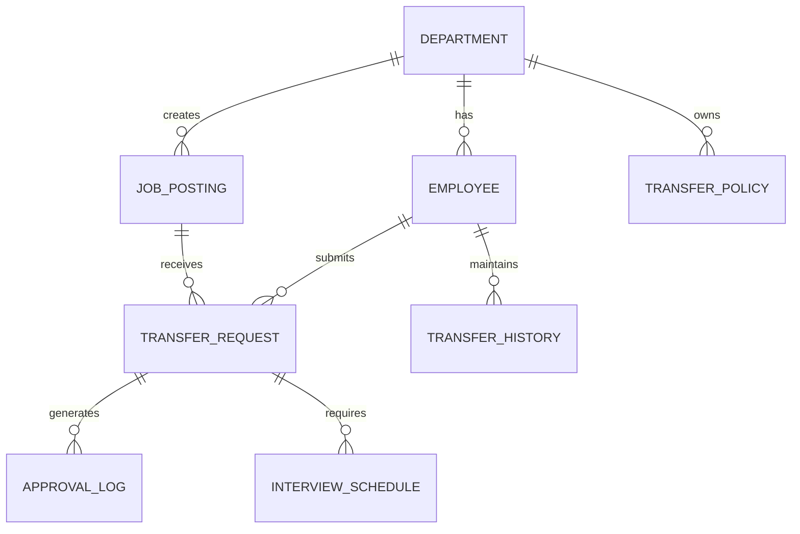

# Conceptual ERD — Internal Mobility and Transfer System

## Mermaid Code

## Entity Description Table | Bang mo ta Entity

| # | Entity Name | Vietnamese Name | Description | Key Attributes | Main Relationships |
|---|-------------|-----------------|-------------|----------------|-------------------|
| 1 | DEPARTMENT | Phong ban | Thong tin cac phong ban trong cong ty | department_id, name | has EMPLOYEE, creates JOB_POSTING |
| 2 | EMPLOYEE | Nhan vien | Ho so ca nhan cua nhan vien | employee_id, name, title | submits TRANSFER_REQUEST |
| 3 | JOB_POSTING | Tin tuyen dung noi bo | Co hoi viec lam luan chuyen noi bo | posting_id, title, status | receives TRANSFER_REQUEST |
| 4 | TRANSFER_REQUEST | Don luan chuyen | Yeu cau luan chuyen cua nhan vien | request_id, date, status | generates APPROVAL_LOG |
| 5 | TRANSFER_HISTORY | Lich su luan chuyen | Luu tru cac lan luan chuyen cua nhan vien | history_id, effective_date | belongs to EMPLOYEE |
| 6 | APPROVAL_LOG | Nhat ky duyet | Ghi nhan cac buoc duyet don luan chuyen | log_id, action, timestamp | belongs to TRANSFER_REQUEST |
| 7 | INTERVIEW_SCHEDULE | Lich phong van | Lich danh gia ung vien noi bo | schedule_id, datetime | belongs to TRANSFER_REQUEST |
| 8 | TRANSFER_POLICY | Chinh sach luan chuyen | Quy tac, dieu kien luan chuyen theo phong ban | policy_id, rules | belongs to DEPARTMENT |

## Relationship Description | Mo ta Quan he

| # | From Entity | Cardinality | To Entity | Relationship Label | Business Explanation |
|---|-------------|-------------|-----------|-------------------|----------------------|
| 1 | DEPARTMENT | one-to-many | EMPLOYEE | has | Mot phong ban co the co nhieu nhan vien. |
| 2 | DEPARTMENT | one-to-many | JOB_POSTING | creates | Mot phong ban tao nhieu tin tuyen dung noi bo. |
| 3 | EMPLOYEE | one-to-many | TRANSFER_REQUEST | submits | Mot nhan vien co the nop nhieu don luan chuyen qua cac thoi ky. |
| 4 | EMPLOYEE | one-to-many | TRANSFER_HISTORY | maintains | Mot nhan vien co lich su luan chuyen nhieu lan. |
| 5 | JOB_POSTING | one-to-many | TRANSFER_REQUEST | receives | Mot tin tuyen dung noi bo co the nhan nhieu don yeu cau luan chuyen. |
| 6 | TRANSFER_REQUEST | one-to-many | APPROVAL_LOG | generates | Mot don luan chuyen sinh ra nhieu buoc nhat ky xet duyet. |
| 7 | TRANSFER_REQUEST | one-to-many | INTERVIEW_SCHEDULE | requires | Mot don luan chuyen co the yeu cau nhieu buoc phong van. |
| 8 | DEPARTMENT | one-to-many | TRANSFER_POLICY | owns | Mot phong ban co the thiet lap nhieu chinh sach luan chuyen rieng. |
