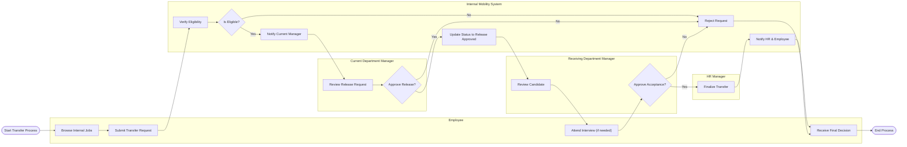

# Swimlane Diagram — Internal Mobility and Transfer System

## Mermaid Code

## Flow Description | Mo ta luong

| Lane | Actor | Role in Flow |
|------|-------|-------------|
| 1 | Employee | Nguoi chu dong tim kiem co hoi, nop don luan chuyen va tham gia phong van neu can. |
| 2 | Internal Mobility System | He thong kiem tra tinh hop le, dieu phoi thong bao va luu tru trang thai. |
| 3 | Current Department Manager | Quan ly hien tai xem xet va quyet dinh cho phep nhan vien roi khoi phong ban hay khong. |
| 4 | Receiving Department Manager | Quan ly phong ban moi xem xet, phong van va quyet dinh tiep nhan nhan vien. |
| 5 | HR Manager | Kiem tra cuoi cung va hoan tat cac thu tuc nhan su de chot quy trinh luan chuyen. |
