# Action Tree — Internal Mobility and Transfer System

## Mermaid Code

```mermaid
%%{init: {'theme': 'default'}}%%
graph TD
    Root["Internal Mobility and Transfer System"]

    Root --> M1["Job Posting Management"]
    Root --> M2["Application Management"]
    Root --> M3["Approval Workflow"]
    Root --> M4["Transfer Execution"]
    Root --> M5["System Administration"]

    M1 --> A11["Create Internal Job"]
    M1 --> A12["Publish Job Posting"]
    M1 --> A13["Close Job Posting"]
    M1 --> A14["View Posting Analytics"]

    M2 --> A21["Apply for Job"]
    M2 --> A22["Withdraw Application"]
    M2 --> A23["Track Application Status"]
    M2 --> A24["Schedule Interviews"]

    M3 --> A31["Approve Employee Release"]
    M3 --> A32["Reject Employee Release"]
    M3 --> A33["Approve Acceptance"]
    M3 --> A34["Review HR Compliance"]

    M4 --> A41["Finalize Transfer Date"]
    M4 --> A42["Sync with Core HR"]
    M4 --> A43["Sync with Payroll"]
    M4 --> A44["Generate Transfer Letter"]

    M5 --> A51["Manage Users & Roles"]
    M5 --> A52["Configure Transfer Policies"]
    M5 --> A53["View Audit Logs"]
```

## Module Description | Mo ta Module

| # | Module | Description | Actions |
|---|--------|-------------|---------|
| 1 | Job Posting Management | Quan ly cac tin tuyen dung danh rieng cho noi bo | Create Internal Job, Publish Job Posting, Close Job Posting, View Posting Analytics |
| 2 | Application Management | Nhan vien tao va theo doi don xin luan chuyen | Apply for Job, Withdraw Application, Track Application Status, Schedule Interviews |
| 3 | Approval Workflow | Quy trinh xet duyet qua nhieu cap quan ly | Approve Employee Release, Reject Employee Release, Approve Acceptance, Review HR Compliance |
| 4 | Transfer Execution | Buoc hoan tat luan chuyen va dong bo he thong | Finalize Transfer Date, Sync with Core HR, Sync with Payroll, Generate Transfer Letter |
| 5 | System Administration | Quan tri va thiet lap cac tham so he thong | Manage Users & Roles, Configure Transfer Policies, View Audit Logs |
