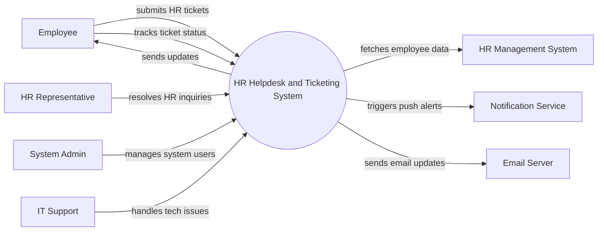

# Context Diagram — HR Helpdesk and Ticketing System

## Mermaid Code

## Actor & Interaction Table | Bang Actor & Tuong tac

| # | Actor | Actor Type | Data Sent TO System | Data Received FROM System | Notes |
|---|-------|------------|---------------------|---------------------------|-------|
| 1 | Employee | Primary | Ticket details, replies, attachments | Ticket status, resolution notes | Nhan vien gui yeu cau |
| 2 | HR Representative | Primary | Ticket resolutions, comments, status updates | Assigned tickets, employee details | Nhan vien nhan su xu ly |
| 3 | System Admin | Primary | System configurations, user roles | System logs, performance reports | Quan tri he thong |
| 4 | IT Support | Supporting | Technical resolutions | Escalated IT tickets | Ho tro ky thuat |
| 5 | HR Management System | Supporting | Employee profile data, department info | Data requests | He thong nhan su loi |
| 6 | Notification Service | Supporting | Delivery statuses | Push notification payloads | Dich vu thong bao |
| 7 | Email Server | Supporting | Delivery statuses | Email contents | May chu gui mail |

## System Boundary Description | Mo ta Pham vi He thong

The HR Helpdesk and Ticketing System is a centralized platform for managing employee inquiries, complaints, and requests related to HR policies. It allows employees to submit and track tickets while HR Representatives can efficiently resolve them. The system does not manage core HR data directly; it integrates with the HR Management System for employee profiles. Technical issues are escalated to IT Support, and all communications are handled via integrations with the Email Server and Notification Service.
