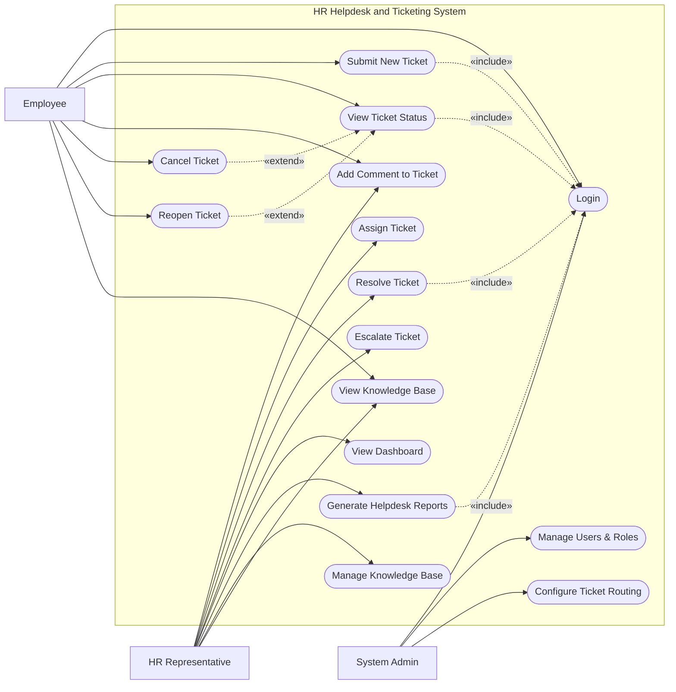

# Use Case Diagram — HR Helpdesk and Ticketing System

## Mermaid Code

## Actor Table | Bang Actor

| # | Actor | Actor Type | Role Description | Related Use Cases |
|---|-------|------------|------------------|-------------------|
| 1 | Employee | Primary | Nhan vien thong thuong gui yeu cau | UC01, UC02, UC03, UC04, UC05, UC08, UC13 |
| 2 | HR Representative | Primary | Nhan vien HR tiep nhan va xu ly ticket | UC04, UC06, UC07, UC09, UC10, UC11, UC12, UC13 |
| 3 | System Admin | Primary | Quan tri vien he thong, phan quyen va cai dat | UC01, UC14, UC15 |

## Use Case Table | Bang Use Case

| # | UC ID | Use Case Name | Primary Actor | Secondary Actor | Description | Priority |
|---|-------|---------------|---------------|-----------------|-------------|----------|
| 1 | UC01 | Login | Employee | | Authenticate user access | High |
| 2 | UC02 | Submit New Ticket | Employee | | Nhan vien tao mot ticket moi cho HR | High |
| 3 | UC03 | View Ticket Status | Employee | | Xem tinh trang cua cac ticket da gui | High |
| 4 | UC04 | Add Comment to Ticket | Employee | HR Representative | Them binh luan hoac thong tin vao ticket | Medium |
| 5 | UC05 | Cancel Ticket | Employee | | Nhan vien huy ticket truoc khi xu ly xong | Low |
| 6 | UC06 | Assign Ticket | HR Representative | | Phan cong ticket cho mot HR cu the | High |
| 7 | UC07 | Resolve Ticket | HR Representative | | HR danh dau ticket da duoc xu ly | High |
| 8 | UC08 | Reopen Ticket | Employee | | Mo lai ticket neu van de chua duoc giai quyet | Medium |
| 9 | UC09 | Escalate Ticket | HR Representative | IT Support | Chuyen ticket len cap cao hon hoac phong ban khac | Medium |
| 10| UC10 | View Dashboard | HR Representative | | Xem tong quan tinh hinh xu ly ticket | Medium |
| 11| UC11 | Generate Helpdesk Reports | HR Representative | | Tao bao cao thong ke ve ticket | Medium |
| 12| UC12 | Manage Knowledge Base | HR Representative | | Them/sua/xoa bai viet huong dan | Low |
| 13| UC13 | View Knowledge Base | Employee | | Nhan vien tim kiem tai lieu huong dan | Medium |
| 14| UC14 | Manage Users & Roles | System Admin | | Quan ly tai khoan va quyen han | High |
| 15| UC15 | Configure Ticket Routing | System Admin | | Cai dat luat phan luong ticket tu dong | High |

## Use Case Specification | Dac ta Use Case

---

### UC02 — Submit New Ticket

| Field | Detail |
|-------|--------|
| **UC ID** | UC02 |
| **Use Case Name** | Submit New Ticket |
| **Actor(s)** | Primary: Employee |
| **Description** | Cho phep nhan vien tao mot yeu cau moi gui den phong Nhan su (HR). |
| **Precondition** | 1. Nhan vien da dang nhap (Include UC01).  2. He thong dang hoat dong binh thuong. |
| **Main Flow** | 1. Actor chon "Create Ticket" tren giao dien.  2. System hien thi form tao ticket.  3. Actor chon danh muc (Category), nhap tieu de (Subject) va mo ta (Description).  4. Actor dinh kem file (neu co).  5. Actor nhan "Submit".  6. System xac nhan, tao ticket moi va phan luong den HR. |
| **Alternative Flow** | **AF1** — Tim kiem bai viet: Truoc khi Submit, System goi y bai viet Knowledge Base. Neu Actor thay ket qua, ho co the huy tao ticket. |
| **Exception Flow** | **EX1** — Thieu thong tin: Neu cac truong bat buoc bi de trong, System hien thi canh bao va khong cho Submit. |
| **Postcondition** | Mot ticket moi duoc tao voi trang thai "Open". |
| **Business Rule** | **BR1**: File dinh kem khong duoc vuot qua 10MB.  **BR2**: Ticket phai co Category de he thong tu dong phan luong. |

---

### UC07 — Resolve Ticket

| Field | Detail |
|-------|--------|
| **UC ID** | UC07 |
| **Use Case Name** | Resolve Ticket |
| **Actor(s)** | Primary: HR Representative |
| **Description** | HR Representative giai quyet van de va dong ticket. |
| **Precondition** | 1. HR Representative da dang nhap (Include UC01).  2. Ticket dang o trang thai "In Progress" hoac "Open". |
| **Main Flow** | 1. Actor chon mot ticket dang can xu ly.  2. System hien thi chi tiet ticket.  3. Actor nhap noi dung giai quyet vao phan phan hoi.  4. Actor chon trang thai "Resolved".  5. Actor nhan "Update".  6. System luu thong tin va gui email thong bao den nhan vien. |
| **Alternative Flow** | **AF1** — Yeu cau them thong tin: Thay vi dong ticket, Actor co the chon "Pending User" de yeu cau nhan vien bo sung. |
| **Exception Flow** | **EX1** — Chua duoc phan cong: Neu ticket chua duoc gan cho ai, System yeu cau Actor phai Assign cho minh truoc khi Resolve. |
| **Postcondition** | Ticket duoc chuyen sang trang thai "Resolved". |
| **Business Rule** | **BR1**: Phai co noi dung phan hoi (Resolution Note) truoc khi Resolve. |

---

### UC09 — Escalate Ticket

| Field | Detail |
|-------|--------|
| **UC ID** | UC09 |
| **Use Case Name** | Escalate Ticket |
| **Actor(s)** | Primary: HR Representative / Secondary: IT Support |
| **Description** | Chuyen ticket cho quan ly hoac bo phan khac (vd: IT) khi vuot qua tham quyen hoac kha nang xu ly cua HR. |
| **Precondition** | 1. HR Representative da dang nhap.  2. Ticket dang trong trang thai cho xu ly. |
| **Main Flow** | 1. Actor mo chi tiet ticket.  2. Actor chon tinh nang "Escalate".  3. System yeu cau chon bo phan hoac nguoi nhan.  4. Actor nhap ly do escalate va nhan Confirm.  5. System cap nhat nguoi phu trach va gui thong bao. |
| **Alternative Flow** | **AF1** — Escalate tu dong: Neu ticket vuot qua thoi gian SLA, System tu dong escalate ticket len cap quan ly. |
| **Exception Flow** | **EX1** — Khong tim thay nguoi nhan: Neu danh sach nguoi nhan trong, System bao loi va yeu cau kiem tra lai phan quyen. |
| **Postcondition** | Ticket duoc gan cho bo phan/nguoi phu trach moi voi muc do uu tien cao hon. |
| **Business Rule** | **BR1**: Moi lan Escalate deu phai luu lai lich su tren ticket. |

---

### UC15 — Configure Ticket Routing

| Field | Detail |
|-------|--------|
| **UC ID** | UC15 |
| **Use Case Name** | Configure Ticket Routing |
| **Actor(s)** | Primary: System Admin |
| **Description** | Quan tri vien thiet lap cac quy tac tu dong de phan phoi ticket den dung HR Representative theo danh muc (Category). |
| **Precondition** | 1. System Admin da dang nhap (Include UC01).  2. Danh sach HR Representative da ton tai trong he thong. |
| **Main Flow** | 1. Actor truy cap vao muc "Routing Settings".  2. System hien thi danh sach cac luat phan luong hien tai.  3. Actor chon "Add New Rule".  4. Actor chon dieu kien (VD: Category = Payroll).  5. Actor chi dinh nguoi hoac nhom nhan ticket nay.  6. Actor luu cau hinh, System xac nhan va ap dung ngay lap tuc. |
| **Alternative Flow** | **AF1** — Sua luat cu: O buoc 3, Actor co the chon "Edit" tren mot luat da co. |
| **Exception Flow** | **EX1** — Trung lap luat: Neu tao mot luat moi bi trung voi luat hien tai, System hien thi canh bao. |
| **Postcondition** | He thong se tu dong phan luong cac ticket moi dua theo luat vua tao. |
| **Business Rule** | **BR1**: Luat co do uu tien cao se duoc ap dung truoc.  **BR2**: Chi System Admin moi co quyen thay doi routing. |
