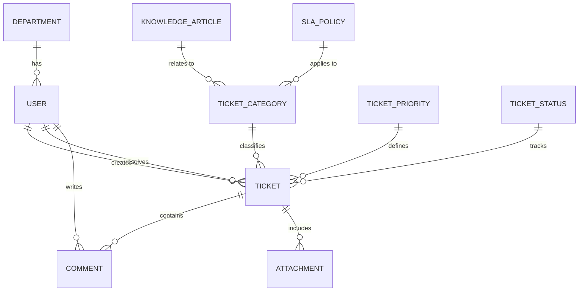

# Conceptual ERD — HR Helpdesk and Ticketing System

## Mermaid Code

## Entity Description Table | Bang mo ta Entity

| # | Entity Name | Vietnamese Name | Description | Key Attributes | Main Relationships |
|---|-------------|-----------------|-------------|----------------|-------------------|
| 1 | USER | Nguoi dung | Thong tin nhan vien, HR, Admin | user_id, name, role, email | creates TICKET, resolves TICKET |
| 2 | DEPARTMENT | Phong ban | Thong tin cac phong ban | department_id, name | has USER |
| 3 | TICKET | The yeu cau | Yeu cau/Van de duoc tao boi user | ticket_id, subject, description, created_at | classified by CATEGORY, tracks STATUS |
| 4 | TICKET_CATEGORY | Danh muc | Phan loai linh vuc cua yeu cau | category_id, name, routing_rule | classifies TICKET |
| 5 | TICKET_PRIORITY | Do uu tien | Muc do khan cap cua ticket | priority_id, level, name | defines TICKET |
| 6 | TICKET_STATUS | Trang thai | Trang thai tien do hien tai | status_id, status_name | tracks TICKET |
| 7 | COMMENT | Binh luan | Loi trao doi tren mot ticket | comment_id, content, created_at | belongs to TICKET, written by USER |
| 8 | ATTACHMENT | File dinh kem | Tai lieu kem theo ticket | attachment_id, file_path, file_size | belongs to TICKET |
| 9 | KNOWLEDGE_ARTICLE| Bai viet huong dan | Tai lieu giai dap the huu ich | article_id, title, content | relates to TICKET_CATEGORY |
| 10| SLA_POLICY | Chinh sach SLA | Cam ket thoi gian xu ly theo category | sla_id, response_time, resolution_time | applies to TICKET_CATEGORY |

## Relationship Description | Mo ta Quan he

| # | From Entity | Cardinality | To Entity | Relationship Label | Business Explanation |
|---|-------------|-------------|-----------|-------------------|----------------------|
| 1 | DEPARTMENT | one-to-many | USER | has | Mot phong ban co the co nhieu nhan vien. |
| 2 | USER | one-to-many | TICKET | creates | Mot nhan vien co the tao nhieu ticket. |
| 3 | USER | one-to-many | TICKET | resolves | Mot nhan vien HR co the xu ly nhieu ticket. |
| 4 | TICKET_CATEGORY | one-to-many | TICKET | classifies | Mot danh muc co the phan loai nhieu ticket. |
| 5 | TICKET_PRIORITY | one-to-many | TICKET | defines | Mot do uu tien ap dung cho nhieu ticket. |
| 6 | TICKET_STATUS | one-to-many | TICKET | tracks | Mot trang thai co the gan cho nhieu ticket. |
| 7 | TICKET | one-to-many | COMMENT | contains | Mot ticket co the chua nhieu binh luan qua lai. |
| 8 | TICKET | one-to-many | ATTACHMENT | includes | Mot ticket co the co nhieu file dinh kem. |
| 9 | USER | one-to-many | COMMENT | writes | Mot nguoi dung co the viet nhieu binh luan. |
| 10| KNOWLEDGE_ARTICLE | one-to-many | TICKET_CATEGORY | relates to | Bai viet huong dan duoc xep vao nhieu danh muc de de tim. |
| 11| SLA_POLICY | one-to-many | TICKET_CATEGORY | applies to | Mot chinh sach cam ket SLA ap dung cho nhieu danh muc. |
