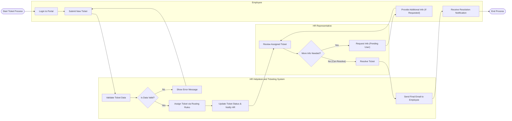

# Swimlane Diagram — HR Helpdesk and Ticketing System

## Mermaid Code

## Flow Description | Mo ta luong

| Lane | Actor | Role in Flow |
|------|-------|-------------|
| 1 | Employee | Nhan vien chu dong dang nhap, gui yeu cau (ticket), bo sung thong tin khi duoc yeu cau va nhan thong bao cuoi cung. |
| 2 | HR Helpdesk and Ticketing System | He thong tu dong kiem tra hop le, phan luong dua vao rule, cap nhat trang thai va gui thong bao email cho cac ben. |
| 3 | HR Representative | Nhan vien Nhan su tiep nhan ticket, xem xet, yeu cau bo sung thong tin (neu can) va truc tiep giai quyet van de. |
