# Action Tree — HR Helpdesk and Ticketing System

## Mermaid Code

```mermaid
%%{init: {'theme': 'default'}}%%
graph TD
    Root["HR Helpdesk and Ticketing System"]

    Root --> M1["User Management"]
    Root --> M2["Ticket Management"]
    Root --> M3["Knowledge Base"]
    Root --> M4["Reporting & Analytics"]
    Root --> M5["System Configuration"]

    M1 --> A11["Manage Profiles"]
    M1 --> A12["Assign Roles"]
    M1 --> A13["Manage Access Rights"]

    M2 --> A21["Create Ticket"]
    M2 --> A22["Assign Ticket"]
    M2 --> A23["Resolve Ticket"]
    M2 --> A24["Escalate Ticket"]
    M2 --> A25["Add Comments"]

    M3 --> A31["Search Articles"]
    M3 --> A32["Create Article"]
    M3 --> A33["Publish Article"]
    M3 --> A34["Delete Article"]

    M4 --> A41["View Dashboard"]
    M4 --> A42["Export Reports"]
    M4 --> A43["Track SLA Performance"]
    M4 --> A44["Monitor Workload"]

    M5 --> A51["Configure Routing Rules"]
    M5 --> A52["Set SLA Policies"]
    M5 --> A53["Manage Categories"]
    M5 --> A54["Customize Email Templates"]
```

## Module Description | Mo ta Module

| # | Module | Description | Actions |
|---|--------|-------------|---------|
| 1 | User Management | Quan ly thong tin, tai khoan va phan quyen nguoi dung. | Manage Profiles, Assign Roles, Manage Access Rights |
| 2 | Ticket Management | Module loi xu ly vong doi cua mot the yeu cau (ticket). | Create Ticket, Assign Ticket, Resolve Ticket, Escalate Ticket, Add Comments |
| 3 | Knowledge Base | Luu tru va tim kiem cac bai viet huong dan tra loi nhanh. | Search Articles, Create Article, Publish Article, Delete Article |
| 4 | Reporting & Analytics | Cung cap cac bieu do va bao cao ve hieu suat xu ly ticket. | View Dashboard, Export Reports, Track SLA Performance, Monitor Workload |
| 5 | System Configuration | Cai dat cac tham so, quy tac tu dong va giao dien he thong. | Configure Routing Rules, Set SLA Policies, Manage Categories, Customize Email Templates |
