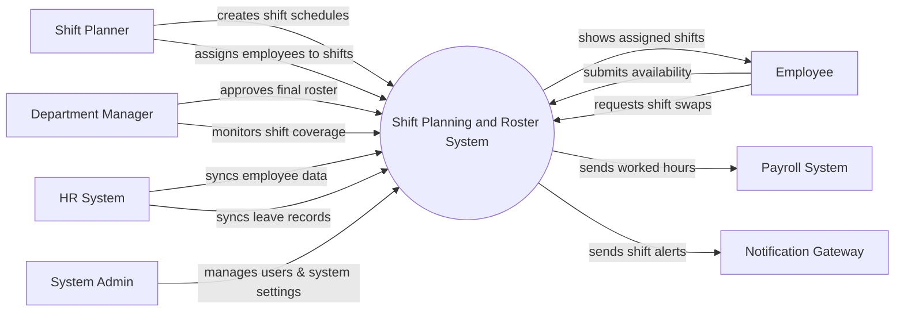

# Context Diagram — Shift Planning and Roster System

## Mermaid Code

## Actor & Interaction Table | Bang Actor & Tuong tac

| # | Actor | Actor Type | Data Sent TO System | Data Received FROM System | Notes |
|---|-------|------------|---------------------|---------------------------|-------|
| 1 | Shift Planner | Primary | Shift schedules, assignments, rule configurations | Coverage alerts, roster drafts | Nguoi xep lich lam viec |
| 2 | Employee | Primary | Work availability, shift swap requests | Shift schedules, swap approvals | Nhan vien lam theo ca |
| 3 | Department Manager | Primary | Roster approvals, coverage thresholds | Coverage reports, final rosters | Quan ly phong ban |
| 4 | System Admin | Primary | System configurations, user roles | System logs, audit reports | Quan tri he thong |
| 5 | HR System | Supporting | Employee profiles, leave records | Data sync acknowledgments | He thong nhan su |
| 6 | Payroll System | Supporting | Processing confirmations | Worked hours, shift differentials | He thong tinh luong |
| 7 | Notification Gateway | Supporting | Delivery statuses | SMS/Email shift alerts | Cong gui tin nhan |

## System Boundary Description | Mo ta Pham vi He thong

The Shift Planning and Roster System is responsible for managing employee work schedules, processing shift swaps, and ensuring adequate coverage across departments. It allows planners to create rosters and employees to interact with their assigned shifts. The system does not handle actual payroll calculations or long-term HR profile management; it integrates with external HR and Payroll Systems to exchange this data. Additionally, all communications such as SMS and emails are routed through an external Notification Gateway.
