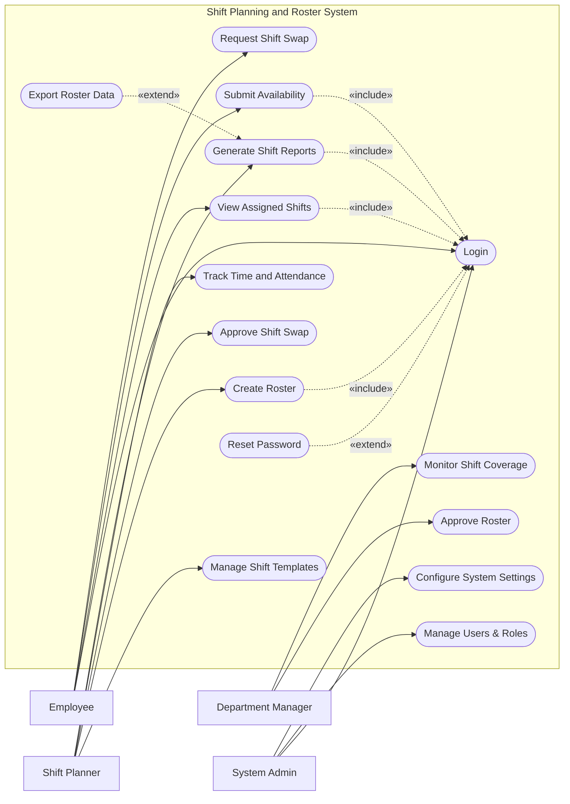

# Use Case Diagram — Shift Planning and Roster System

## Mermaid Code

## Actor Table | Bang Actor

| # | Actor | Actor Type | Role Description | Related Use Cases |
|---|-------|------------|------------------|-------------------|
| 1 | Employee | Primary | Nhan vien can xem va tuong tac voi lich lam viec | UC01, UC04, UC05, UC06 |
| 2 | Shift Planner | Primary | Nguoi chiu trach nhiem thiet ke va phan bo ca lam viec | UC02, UC03, UC07, UC10, UC11 |
| 3 | Department Manager | Primary | Quan ly chung, kiem tra do bao phu va duyet lich | UC08, UC09 |
| 4 | System Admin | Primary | Quan tri vien he thong, phan quyen va cai dat | UC01, UC12, UC13 |

## Use Case Table | Bang Use Case

| # | UC ID | Use Case Name | Primary Actor | Secondary Actor | Description | Priority |
|---|-------|---------------|---------------|-----------------|-------------|----------|
| 1 | UC01 | Login | Employee | | Authenticate user access | High |
| 2 | UC02 | Manage Shift Templates | Shift Planner | | Create and modify standard shift times | Medium |
| 3 | UC03 | Create Roster | Shift Planner | | Assign employees to specific shifts | High |
| 4 | UC04 | View Assigned Shifts | Employee | | View personal upcoming work schedules | High |
| 5 | UC05 | Submit Availability | Employee | | Inform planners of available working hours | High |
| 6 | UC06 | Request Shift Swap | Employee | | Request to trade a shift with a colleague | High |
| 7 | UC07 | Approve Shift Swap | Shift Planner | | Review and approve/reject swap requests | High |
| 8 | UC08 | Approve Roster | Department Manager | | Finalize and lock a draft roster for publication | High |
| 9 | UC09 | Monitor Shift Coverage | Department Manager | | Check if all required shifts are adequately staffed | Medium |
| 10| UC10 | Track Time and Attendance | Shift Planner | | Record actual hours worked against shifts | High |
| 11| UC11 | Generate Shift Reports | Shift Planner | | Create statistical reports on shift assignments | Medium |
| 12| UC12 | Manage Users & Roles | System Admin | | Create, update, or deactivate user accounts | High |
| 13| UC13 | Configure System Settings | System Admin | | Update system-wide scheduling rules | Medium |
| 14| UC14 | Reset Password | Employee | | Recover account access | High |
| 15| UC15 | Export Roster Data | Shift Planner | | Download roster details as files | Low |

## Use Case Specification | Dac ta Use Case

---

### UC01 — Login

| Field | Detail |
|-------|--------|
| **UC ID** | UC01 |
| **Use Case Name** | Login |
| **Actor(s)** | Primary: Employee, Shift Planner, Department Manager, System Admin |
| **Description** | Cho phep nguoi dung xac thuc de dang nhap vao he thong. |
| **Precondition** | 1. Nguoi dung phai co tai khoan hop le tren he thong.  2. He thong dang hoat dong binh thuong. |
| **Main Flow** | 1. Actor mo trang dang nhap.  2. System hien thi form dang nhap.  3. Actor nhap username va password.  4. Actor nhan nut Submit.  5. System xac thuc thong tin.  6. System chuyen huong den man hinh Dashboard tuong ung. |
| **Alternative Flow** | **AF1** — Quen mat khau: Neu Actor chon "Forgot Password", System kich hoat UC14 Reset Password. |
| **Exception Flow** | **EX1** — Sai thong tin: Neu xac thuc that bai, System hien thi thong bao loi va yeu cau nhap lai.  **EX2** — Tai khoan bi khoa: Neu nhap sai qua 5 lan, System khoa tai khoan va yeu cau lien he Admin. |
| **Postcondition** | Nguoi dung duoc dang nhap va phien lam viec duoc khoi tao. |
| **Business Rule** | **BR1**: Mat khau phai duoc ma hoa an toan.  **BR2**: Phien lam viec tu dong het han sau 60 phut khong hoat dong. |

---

### UC03 — Create Roster

| Field | Detail |
|-------|--------|
| **UC ID** | UC03 |
| **Use Case Name** | Create Roster |
| **Actor(s)** | Primary: Shift Planner |
| **Description** | Cho phep Planner tao moi lich lam viec cho mot thoi gian cu the. |
| **Precondition** | 1. Planner da dang nhap (Include UC01).  2. Danh sach nhan vien va template ca lam da san sang. |
| **Main Flow** | 1. Actor chon "Create Roster".  2. System yeu cau chon phong ban va khoang thoi gian.  3. Actor chon thong tin va nhan "Start".  4. System hien thi giao dien xep ca, kem thong tin availability cua nhan vien.  5. Actor keo tha hoac gan nhan vien vao tung ca lam.  6. Actor nhan "Save Draft".  7. System luu lich o trang thai "Draft". |
| **Alternative Flow** | **AF1** — Tu dong xep ca: O buoc 5, Actor chon "Auto-fill", System tu dong dien nhan vien vao ca dua tren rules va availability. |
| **Exception Flow** | **EX1** — Vi pham quy tac: Neu Actor gan ca lam vi pham thoi gian nghi toi thieu, System hien thi canh bao mau do nhung van cho phep luu Draft. |
| **Postcondition** | Ban nhap lich lam viec duoc tao va luu trong he thong. |
| **Business Rule** | **BR1**: Nhan vien phai co it nhat 11 tieng nghi giua hai ca lam viec lien tiep.  **BR2**: So gio lam toi da cua nhan vien moi tuan khong vuot qua gioi han quy dinh. |

---

### UC05 — Submit Availability

| Field | Detail |
|-------|--------|
| **UC ID** | UC05 |
| **Use Case Name** | Submit Availability |
| **Actor(s)** | Primary: Employee |
| **Description** | Nhan vien dang ky thoi gian co the hoac khong the lam viec. |
| **Precondition** | 1. Employee da dang nhap (Include UC01).  2. Lich lam viec tuan/thang toi chua bi khoa (lock). |
| **Main Flow** | 1. Actor vao muc "My Availability".  2. System hien thi lich (calendar) cua thang tiep theo.  3. Actor chon cac ngay/gio khong the lam viec (Unavailable) hoac uu tien (Preferred).  4. Actor nhan "Submit".  5. System kiem tra han chot dang ky.  6. System luu thong tin va cap nhat ho so cua nhan vien de Planner su dung. |
| **Alternative Flow** | **AF1** — Huy bo: Truoc khi luu, Actor chon "Cancel" thi he thong quay lai trang thai ban dau. |
| **Exception Flow** | **EX1** — Qua han dang ky: Neu da qua deadline gui availability, System chan hanh dong va hien thi loi "Deadline passed". |
| **Postcondition** | Thong tin lich ranh cua nhan vien duoc he thong ghi nhan. |
| **Business Rule** | **BR1**: Availability phai duoc nop it nhat 14 ngay truoc khi bat dau ky xep lich moi.  **BR2**: Khong the dang ky Unavailable cho nhung ngay co tinh chat bat buoc lam viec. |

---

### UC06 — Request Shift Swap

| Field | Detail |
|-------|--------|
| **UC ID** | UC06 |
| **Use Case Name** | Request Shift Swap |
| **Actor(s)** | Primary: Employee |
| **Description** | Nhan vien yeu cau doi ca lam viec voi mot dong nghiep khac. |
| **Precondition** | 1. Employee da dang nhap (Include UC01).  2. Ca lam viec hien tai phai o tuong lai. |
| **Main Flow** | 1. Actor mo lich ca nhan va chon ca muon doi.  2. System hien thi chi tiet ca va tuy chon "Request Swap".  3. Actor chon dong nghiep muon doi ca cung va nhap ly do.  4. Actor nhan "Submit Request".  5. System kiem tra quy tac doi ca.  6. System luu yeu cau va gui thong bao cho dong nghiep kia va Planner. |
| **Alternative Flow** | **AF1** — Swap len bang tin chung: O buoc 3, Actor co the chon "Open to all" de day ca len bang tin cho bat ky ai ranh dang ky. |
| **Exception Flow** | **EX1** — Khong hop le: Neu viec doi ca vi pham luat (vi du: qua so gio quy dinh cua dong nghiep kia), System tu choi luu va bao loi. |
| **Postcondition** | Yeu cau doi ca luu o trang thai "Pending Approval". |
| **Business Rule** | **BR1**: Ca doi phai cung level ky nang hoac vi tri tuong duong.  **BR2**: Swap phai duoc su dong y cua ca hai nhan vien va su phe duyet cua Planner. |

---

### UC07 — Approve Shift Swap

| Field | Detail |
|-------|--------|
| **UC ID** | UC07 |
| **Use Case Name** | Approve Shift Swap |
| **Actor(s)** | Primary: Shift Planner |
| **Description** | Shift Planner xet duyet hoac tu choi yeu cau doi ca. |
| **Precondition** | 1. Planner da dang nhap.  2. Yeu cau doi ca dang o trang thai Pending va dong nghiep kia da dong y. |
| **Main Flow** | 1. Actor vao muc "Swap Requests".  2. System hien thi danh sach cac yeu cau dang cho.  3. Actor chon xem chi tiet mot yeu cau.  4. System hien thi anh huong cua viec doi ca toi tong the roster.  5. Actor nhan "Approve".  6. System cap nhat lich, gan lai ca va gui thong bao cho hai nhan vien. |
| **Alternative Flow** | **AF1** — Tu choi: O buoc 5, Actor chon "Reject" va nhap ly do. System giu nguyen ca cu va thong bao tu choi. |
| **Exception Flow** | **EX1** — Yeu cau da het han: Neu ca hien tai da qua, System tu dong danh dau la "Expired" va khong the duyet. |
| **Postcondition** | Lich lam viec chinh thuc duoc cap nhat (neu Approve). |
| **Business Rule** | **BR1**: Planner co the tu choi neu viec doi ca gay thieu hut ky nang (skill gap) trong ca do. |
