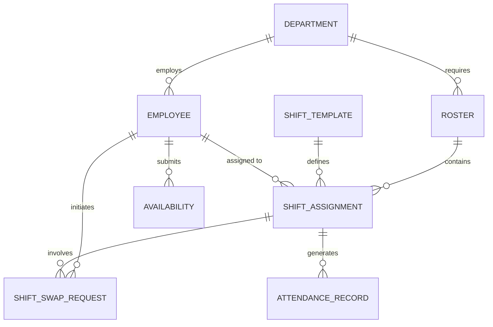

# Conceptual ERD — Shift Planning and Roster System

## Mermaid Code

## Entity Description Table | Bang mo ta Entity

| # | Entity Name | Vietnamese Name | Description | Key Attributes | Main Relationships |
|---|-------------|-----------------|-------------|----------------|-------------------|
| 1 | DEPARTMENT | Phong ban | Thong tin cac phong ban can len lich ca | department_id, name, location | employs EMPLOYEE, requires ROSTER |
| 2 | EMPLOYEE | Nhan vien | Ho so co ban cua nhan vien lam ca | employee_id, name, job_title | assigned to SHIFT_ASSIGNMENT |
| 3 | ROSTER | Lich lam viec tong | Bang lich xep ca cua ca phong ban trong mot ky | roster_id, start_date, status | contains SHIFT_ASSIGNMENT |
| 4 | SHIFT_TEMPLATE | Bieu ca chuan | Cac khung gio ca mac dinh duoc cau hinh san | template_id, shift_name, times | defines SHIFT_ASSIGNMENT |
| 5 | SHIFT_ASSIGNMENT| Phan cong ca | Mot ca lam viec cu the gan cho mot nhan vien | assignment_id, date, status | involves SHIFT_SWAP_REQUEST |
| 6 | AVAILABILITY | Dang ky lich ranh | Thong tin nhan vien ranh/ban trong tuong lai | avail_id, date, preference | belongs to EMPLOYEE |
| 7 | SHIFT_SWAP_REQUEST| Yeu cau doi ca | Don xin doi ca giua hai nhan vien | request_id, reason, status | belongs to EMPLOYEE, SHIFT_ASSIGNMENT |
| 8 | ATTENDANCE_RECORD| Ban ghi cham cong | Gio lam viec thuc te so voi ca phan cong | record_id, clock_in, clock_out | belongs to SHIFT_ASSIGNMENT |

## Relationship Description | Mo ta Quan he

| # | From Entity | Cardinality | To Entity | Relationship Label | Business Explanation |
|---|-------------|-------------|-----------|-------------------|----------------------|
| 1 | DEPARTMENT | one-to-many | EMPLOYEE | employs | Mot phong ban quan ly nhieu nhan vien. |
| 2 | DEPARTMENT | one-to-many | ROSTER | requires | Mot phong ban co the co nhieu lich (qua tung ky). |
| 3 | ROSTER | one-to-many | SHIFT_ASSIGNMENT | contains | Mot bang lich chua nhieu luot phan cong ca cho tung nguoi. |
| 4 | SHIFT_TEMPLATE | one-to-many | SHIFT_ASSIGNMENT | defines | Mot bieu ca (VD: Ca Sang) duoc su dung de tao ra nhieu phan cong ca. |
| 5 | EMPLOYEE | one-to-many | SHIFT_ASSIGNMENT | assigned to | Mot nhan vien co the duoc phan cong vao nhieu ca khac nhau. |
| 6 | EMPLOYEE | one-to-many | AVAILABILITY | submits | Mot nhan vien co the nop nhieu ban ghi dang ky lich ranh. |
| 7 | EMPLOYEE | one-to-many | SHIFT_SWAP_REQUEST | initiates | Mot nhan vien co the khoi tao nhieu yeu cau doi ca. |
| 8 | SHIFT_ASSIGNMENT| one-to-many | SHIFT_SWAP_REQUEST | involves | Mot phan cong ca co the lien quan den nhieu yeu cau doi ca (neu bi tu choi roi yeu cau lai). |
| 9 | SHIFT_ASSIGNMENT| one-to-many | ATTENDANCE_RECORD | generates | Mot ca lam viec sinh ra cac ban ghi cham cong (vao/ra) thuc te. |
