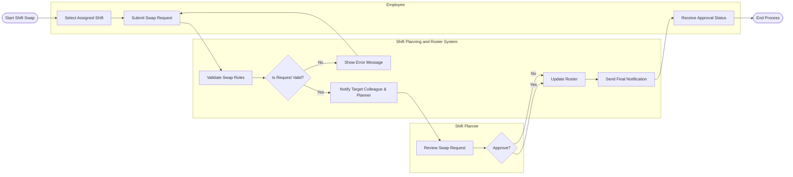

# Swimlane Diagram — Shift Planning and Roster System

## Mermaid Code

## Flow Description | Mo ta luong

| Lane | Actor | Role in Flow |
|------|-------|-------------|
| 1 | Employee | Nguoi chu dong chon ca va tao yeu cau doi ca tren he thong. Nhan ket qua xu ly cuoi cung. |
| 2 | Shift Planning and Roster System | He thong tu dong kiem tra quy tac, gui email/SMS thong bao, cap nhat lai lich neu yeu cau duoc duyet. |
| 3 | Shift Planner | Xem xet cac yeu cau doi ca hop le, ra quyet dinh dong y hoac tu choi de dam bao hoat dong. |
