# Action Tree — Shift Planning and Roster System

## Mermaid Code

```mermaid
%%{init: {'theme': 'default'}}%%
graph TD
    Root["Shift Planning and Roster System"]

    Root --> M1["Employee Portal"]
    Root --> M2["Roster Management"]
    Root --> M3["Shift Operations"]
    Root --> M4["Time & Attendance"]
    Root --> M5["System Administration"]

    M1 --> A11["View My Shifts"]
    M1 --> A12["Submit Availability"]
    M1 --> A13["Request Shift Swap"]
    M1 --> A14["Accept/Reject Swap"]

    M2 --> A21["Create Roster"]
    M2 --> A22["Manage Shift Templates"]
    M2 --> A23["Auto-assign Shifts"]
    M2 --> A24["Publish Roster"]

    M3 --> A31["Approve Shift Swaps"]
    M3 --> A32["Monitor Coverage"]
    M3 --> A33["Handle Absences"]

    M4 --> A41["Track Clock-ins/outs"]
    M4 --> A42["Review Timesheets"]
    M4 --> A43["Export to Payroll"]

    M5 --> A51["Manage Users"]
    M5 --> A52["Configure Rules"]
    M5 --> A53["System Settings"]
```

## Module Description | Mo ta Module

| # | Module | Description | Actions |
|---|--------|-------------|---------|
| 1 | Employee Portal | Giao dien danh cho nhan vien tu quan ly lich cua ho | View My Shifts, Submit Availability, Request Shift Swap, Accept/Reject Swap |
| 2 | Roster Management | Cong cu cho Planner de thiet ke va ban hanh lich | Create Roster, Manage Shift Templates, Auto-assign Shifts, Publish Roster |
| 3 | Shift Operations | Xu ly tinh huong hang ngay va dam bao nhan su | Approve Shift Swaps, Monitor Coverage, Handle Absences |
| 4 | Time & Attendance | Theo doi gio lam thuc te de cung cap cho tinh luong | Track Clock-ins/outs, Review Timesheets, Export to Payroll |
| 5 | System Administration | Quan ly tong the, phan quyen va thiet lap tham so | Manage Users, Configure Rules, System Settings |
