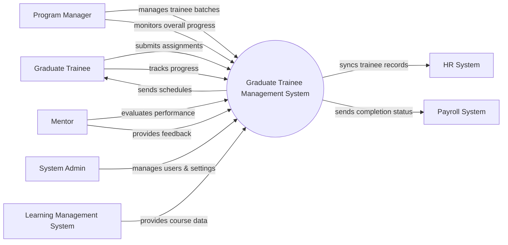

# Context Diagram — Graduate Trainee Management System

## Mermaid Code

## Actor & Interaction Table | Bang Actor & Tuong tac

| # | Actor | Actor Type | Data Sent TO System | Data Received FROM System | Notes |
|---|-------|------------|---------------------|---------------------------|-------|
| 1 | Graduate Trainee | Primary | Assignment submissions, personal updates | Training schedules, feedback, grades | Thuc tap sinh tham gia chuong trinh |
| 2 | Program Manager | Primary | Batch configurations, curriculum plans | Progress reports, batch statistics | Quan ly chuong trinh dao tao |
| 3 | Mentor | Primary | Performance evaluations, feedback, grades | Trainee assignment submissions | Nguoi huong dan thuc tap sinh |
| 4 | System Admin | Primary | User accounts, roles, system configurations | System logs, error alerts | Quan tri vien he thong |
| 5 | HR System | Supporting | Trainee profile updates | Final training records, synced profiles | He thong nhan su cua cong ty |
| 6 | Payroll System | Supporting | Confirmation of receipt | Completion status for salary adjustments | He thong tinh luong |
| 7 | Learning Management System | Supporting | External course progress, scores | Course enrollment requests | He thong quan ly hoc tap |

## System Boundary Description | Mo ta Pham vi He thong

The Graduate Trainee Management System manages the end-to-end training lifecycle of newly hired graduate trainees. It handles batch management, assignment tracking, performance evaluation, and progress monitoring within the program. The system does not directly process payroll or host heavy e-learning content; instead, it integrates with the Payroll System for salary adjustments and the LMS for fetching external course data. It provides dedicated interfaces for Trainees, Mentors, Program Managers, and the System Admin to collaborate effectively.
