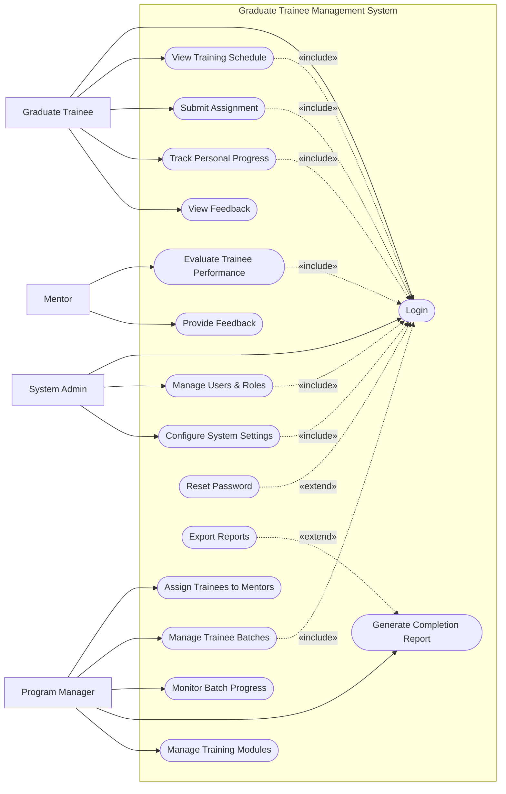

# Use Case Diagram — Graduate Trainee Management System

## Mermaid Code

## Actor Table | Bang Actor

| # | Actor | Actor Type | Role Description | Related Use Cases |
|---|-------|------------|------------------|-------------------|
| 1 | Graduate Trainee | Primary | Thuc tap sinh tham gia chuong trinh | UC01, UC02, UC03, UC04, UC11 |
| 2 | Mentor | Primary | Nguoi huong dan danh gia va ho tro thuc tap sinh | UC05, UC09 |
| 3 | Program Manager | Primary | Nguoi to chuc va quan ly chuong trinh dao tao | UC06, UC07, UC08, UC10, UC12 |
| 4 | System Admin | Primary | Quan tri vien he thong | UC01, UC15, UC16 |

## Use Case Table | Bang Use Case

| # | UC ID | Use Case Name | Primary Actor | Secondary Actor | Description | Priority |
|---|-------|---------------|---------------|-----------------|-------------|----------|
| 1 | UC01 | Login | Graduate Trainee | | Authenticate user access | High |
| 2 | UC02 | View Training Schedule | Graduate Trainee | | View upcoming training sessions | Medium |
| 3 | UC03 | Submit Assignment | Graduate Trainee | | Upload and submit assignments | High |
| 4 | UC04 | Track Personal Progress | Graduate Trainee | | View personal completion status | Medium |
| 5 | UC05 | Evaluate Trainee Performance| Mentor | | Score and assess submitted assignments | High |
| 6 | UC06 | Assign Trainees to Mentors| Program Manager | | Link trainees with their respective mentors | High |
| 7 | UC07 | Manage Trainee Batches | Program Manager | | Create and update trainee groups | High |
| 8 | UC08 | Monitor Batch Progress | Program Manager | | Track overall progress of a batch | Medium |
| 9 | UC09 | Provide Feedback | Mentor | | Give constructive feedback to trainees | Medium |
| 10| UC10 | Generate Completion Report | Program Manager | | Create reports on trainee graduation | Medium |
| 11| UC11 | View Feedback | Graduate Trainee | | Read feedback provided by mentors | Low |
| 12| UC12 | Manage Training Modules | Program Manager | | Configure curriculum and courses | High |
| 13| UC13 | Reset Password | Graduate Trainee | | Recover account access | High |
| 14| UC14 | Export Reports | Program Manager | | Download reports as PDF/Excel files | Low |
| 15| UC15 | Manage Users & Roles | System Admin | | Create or modify user accounts | High |
| 16| UC16 | Configure System Settings | System Admin | | Update system-wide configurations | Medium |

## Use Case Specification | Dac ta Use Case

---

### UC01 — Login

| Field | Detail |
|-------|--------|
| **UC ID** | UC01 |
| **Use Case Name** | Login |
| **Actor(s)** | Primary: Graduate Trainee, Mentor, Program Manager, System Admin |
| **Description** | Cho phep nguoi dung xac thuc de dang nhap vao he thong. |
| **Precondition** | 1. Nguoi dung phai co tai khoan hop le.  2. He thong dang hoat dong. |
| **Main Flow** | 1. Actor mo trang dang nhap.  2. System hien thi form dang nhap.  3. Actor nhap username va password.  4. Actor nhan nut Submit.  5. System xac thuc thong tin.  6. System chuyen huong den Dashboard tuong ung. |
| **Alternative Flow** | **AF1** — Quen mat khau: Neu Actor chon "Forgot Password", System kich hoat UC13 Reset Password. |
| **Exception Flow** | **EX1** — Sai thong tin: Neu xac thuc that bai, System hien thi thong bao loi va yeu cau nhap lai.  **EX2** — Tai khoan bi khoa: Neu nhap sai qua 5 lan, System khoa tai khoan. |
| **Postcondition** | Nguoi dung dang nhap thanh cong, phien lam viec duoc tao. |
| **Business Rule** | **BR1**: Mat khau phai duoc ma hoa.  **BR2**: Tu dong dang xuat sau 30 phut khong hoat dong. |

---

### UC03 — Submit Assignment

| Field | Detail |
|-------|--------|
| **UC ID** | UC03 |
| **Use Case Name** | Submit Assignment |
| **Actor(s)** | Primary: Graduate Trainee |
| **Description** | Cho phep thuc tap sinh nop bai tap cho hoc phan hien tai. |
| **Precondition** | 1. Trainee da dang nhap (Include UC01).  2. Bai tap dang trong thoi gian cho phep nop. |
| **Main Flow** | 1. Actor chon bai tap can nop tren Dashboard.  2. System hien thi man hinh nop bai.  3. Actor tai len file hoac nhap link bai lam.  4. Actor nhan Submit.  5. System kiem tra dinh dang file va dung luong.  6. System luu bai nop va thong bao cho Mentor. |
| **Alternative Flow** | **AF1** — Nop lai: Neu bai tap chua het han, Actor co the ghi de bai nop cu. |
| **Exception Flow** | **EX1** — Qua han: Neu da qua deadline, System chan hanh dong va hien thi loi.  **EX2** — File khong hop le: Neu file vuot qua dung luong cho phep, System thong bao loi. |
| **Postcondition** | Bai tap duoc danh dau la "Submitted". |
| **Business Rule** | **BR1**: Dung luong file toi da khong qua 50MB.  **BR2**: Khong the nop bai sau thoi gian gia han. |

---

### UC05 — Evaluate Trainee Performance

| Field | Detail |
|-------|--------|
| **UC ID** | UC05 |
| **Use Case Name** | Evaluate Trainee Performance |
| **Actor(s)** | Primary: Mentor |
| **Description** | Cho phep nguoi huong dan cham diem va danh gia bai nop cua thuc tap sinh. |
| **Precondition** | 1. Mentor da dang nhap (Include UC01).  2. Co it nhat 1 bai tap da duoc Trainee nop. |
| **Main Flow** | 1. Actor mo danh sach bai nop can cham.  2. System hien thi danh sach cac bai tap chua duoc danh gia.  3. Actor chon mot bai nop de xem chi tiet.  4. Actor nhap diem so va nhan xet chung.  5. Actor nhan nut Save Evaluation.  6. System luu ket qua, cap nhat tien do cua Trainee va gui thong bao. |
| **Alternative Flow** | **AF1** — Luu nhap: Actor co the luu danh gia o trang thai "Draft" de tiep tuc sau. |
| **Exception Flow** | **EX1** — Diem so khong hop le: Neu diem nhap vao ngoai khoang 0-100, System canh bao loi. |
| **Postcondition** | Bai tap duoc cap nhat trang thai thanh "Evaluated", Trainee nhan duoc diem. |
| **Business Rule** | **BR1**: Diem so phai tu 0 den 100.  **BR2**: Nhap nhan xet la bat buoc neu diem duoi 50. |

---

### UC07 — Manage Trainee Batches

| Field | Detail |
|-------|--------|
| **UC ID** | UC07 |
| **Use Case Name** | Manage Trainee Batches |
| **Actor(s)** | Primary: Program Manager |
| **Description** | Cho phep quan ly chuong trinh tao va dieu chinh cac dot thuc tap sinh. |
| **Precondition** | 1. Program Manager da dang nhap (Include UC01). |
| **Main Flow** | 1. Actor chon chuc nang "Manage Batches".  2. System hien thi danh sach cac dot dao tao hien co.  3. Actor chon "Create New Batch".  4. Actor nhap thong tin dot (ten, ngay bat dau, ket thuc).  5. Actor nhan nut Submit.  6. System luu dot moi vao CSDL va hien thi thong bao thanh cong. |
| **Alternative Flow** | **AF1** — Sua dot: Actor chon mot dot hien co va cap nhat thong tin. |
| **Exception Flow** | **EX1** — Truc trac du lieu: Neu ten dot bi trung hoac ngay ket thuc truoc ngay bat dau, System thong bao loi va yeu cau nhap lai. |
| **Postcondition** | Dot dao tao duoc tao moi hoac cap nhat. |
| **Business Rule** | **BR1**: Ten dot dao tao phai la duy nhat.  **BR2**: Ngay bat dau phai truoc ngay ket thuc. |

---

### UC15 — Manage Users & Roles

| Field | Detail |
|-------|--------|
| **UC ID** | UC15 |
| **Use Case Name** | Manage Users & Roles |
| **Actor(s)** | Primary: System Admin |
| **Description** | Quan tri vien thuc hien viec them, xoa, sua va phan quyen nguoi dung he thong. |
| **Precondition** | 1. System Admin da dang nhap (Include UC01). |
| **Main Flow** | 1. Actor vao module "User Management".  2. System hien thi danh sach nguoi dung he thong.  3. Actor chon "Add User" hoac chon de sua mot user ton tai.  4. Actor cung cap thong tin ca nhan va chon Role (Trainee, Mentor, Manager, Admin).  5. Actor nhan Save.  6. System luu tru du lieu, tao tai khoan va cap nhat quyen truy cap. |
| **Alternative Flow** | **AF1** — Vo hieu hoa: Actor co the chon "Deactivate" mot user thay vi xoa de giu lich su. |
| **Exception Flow** | **EX1** — Trung email: Neu email them moi da ton tai, System chan thuc hien va bao loi. |
| **Postcondition** | Thong tin tai khoan nguoi dung duoc cap nhat vao he thong. |
| **Business Rule** | **BR1**: Moi user chi duoc co 1 email duy nhat.  **BR2**: Khong the xoa tai khoan Admin cuoi cung cua he thong. |
