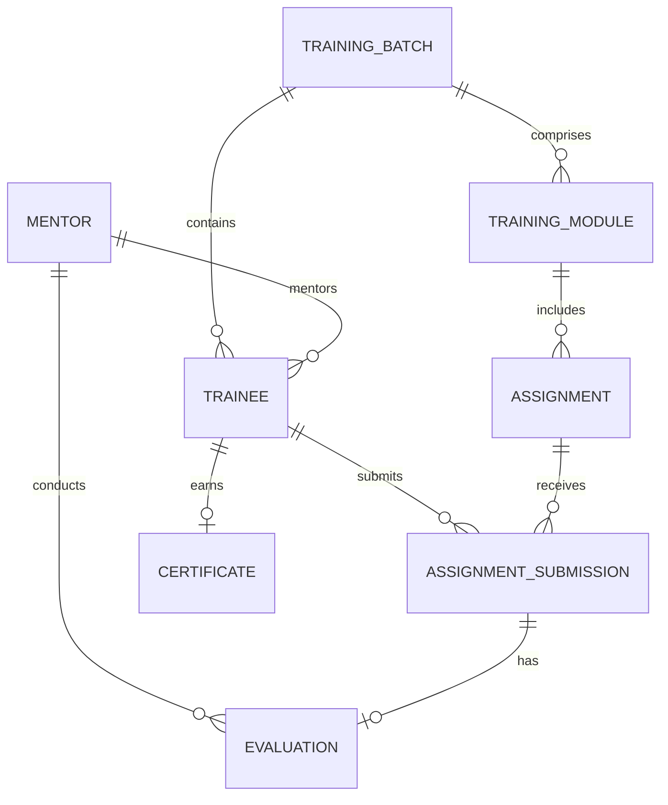

# Conceptual ERD — Graduate Trainee Management System

## Mermaid Code

## Entity Description Table | Bang mo ta Entity

| # | Entity Name | Vietnamese Name | Description | Key Attributes | Main Relationships |
|---|-------------|-----------------|-------------|----------------|-------------------|
| 1 | TRAINING_BATCH | Dot dao tao | Thong tin cac khoa thuc tap sinh | batch_id, name, start_date, end_date | contains TRAINEE |
| 2 | TRAINEE | Thuc tap sinh | Thong tin ca nhan cua thuc tap sinh | trainee_id, name, email, status | submits ASSIGNMENT_SUBMISSION |
| 3 | TRAINING_MODULE | Hoc phan | Cac mon hoc trong chuong trinh dao tao | module_id, title, duration | includes ASSIGNMENT |
| 4 | ASSIGNMENT | Bai tap | Cac bai tap duoc giao trong hoc phan | assignment_id, title, deadline | receives ASSIGNMENT_SUBMISSION |
| 5 | ASSIGNMENT_SUBMISSION| Bai nop | Bai lam do thuc tap sinh nop len he thong | submission_id, file_url, submitted_at | has EVALUATION |
| 6 | MENTOR | Nguoi huong dan | Nguoi phu trach huong dan thuc tap sinh | mentor_id, name, email, department| mentors TRAINEE |
| 7 | EVALUATION | Danh gia | Phieu diem va nhan xet cho bai tap | evaluation_id, score, comments | conducts by MENTOR |
| 8 | CERTIFICATE | Chung chi | Ghi nhan hoan thanh chuong trinh thuc tap | certificate_id, issued_date, grade | earns by TRAINEE |

## Relationship Description | Mo ta Quan he

| # | From Entity | Cardinality | To Entity | Relationship Label | Business Explanation |
|---|-------------|-------------|-----------|-------------------|----------------------|
| 1 | TRAINING_BATCH | one-to-many | TRAINEE | contains | Mot dot dao tao bao gom nhieu thuc tap sinh. |
| 2 | TRAINING_BATCH | one-to-many | TRAINING_MODULE | comprises | Mot dot dao tao bao gom nhieu hoc phan. |
| 3 | TRAINING_MODULE| one-to-many | ASSIGNMENT | includes | Mot hoc phan co the co nhieu bai tap. |
| 4 | TRAINEE | one-to-many | ASSIGNMENT_SUBMISSION | submits | Mot thuc tap sinh nop nhieu bai tap khac nhau. |
| 5 | ASSIGNMENT | one-to-many | ASSIGNMENT_SUBMISSION | receives | Mot bai tap co the nhan nhieu bai nop tu cac trainee. |
| 6 | MENTOR | one-to-many | TRAINEE | mentors | Mot nguoi huong dan the ho tro nhieu thuc tap sinh. |
| 7 | MENTOR | one-to-many | EVALUATION | conducts | Mot nguoi huong dan thuc hien nhieu ban danh gia. |
| 8 | ASSIGNMENT_SUBMISSION | one-to-one | EVALUATION | has | Moi bai nop tuong ung voi mot phieu danh gia. |
| 9 | TRAINEE | one-to-one | CERTIFICATE | earns | Moi thuc tap sinh co the nhan mot chung chi hoan thanh. |
